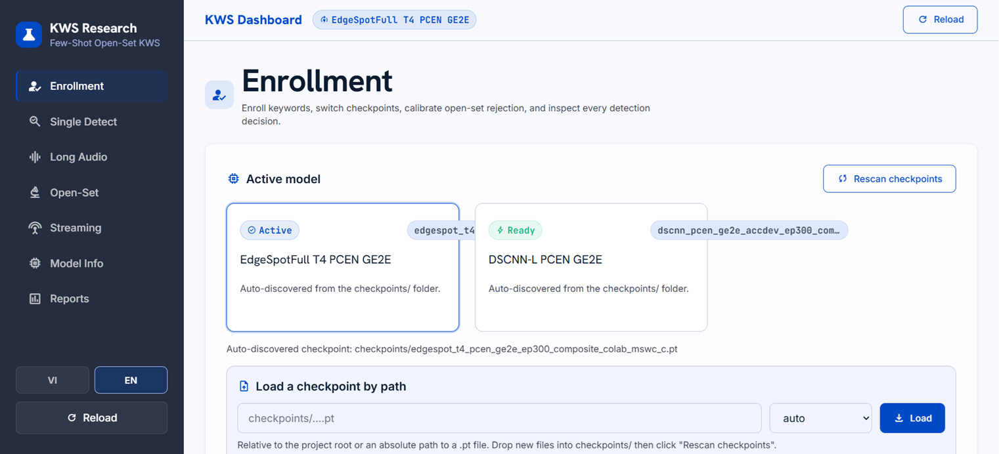

# Few-Shot Open-Set Keyword Spotting

Bachelor thesis project (USTH — University of Science and Technology of Hanoi, defended July 2026).
A keyword spotting system where a user enrolls a new keyword from only a few voice samples —
no retraining — and the model both recognizes enrolled keywords and **rejects everything else**
(open-set rejection), including in live microphone streaming.

📄 **Thesis:** [docs/thesis/PhamHoangAn_23BI14002.pdf](docs/thesis/PhamHoangAn_23BI14002.pdf) ·
🇻🇳 [Vietnamese version](docs/thesis/thesis_vi_2026.pdf) ·
🎤 [Defense script](docs/defense_presentation_script_en.md)



## Results

Evaluated on Google Speech Commands v2 with the `gsc_edgespot_exact` protocol:
10-shot enrollment, word-disjoint train/eval vocabulary, mean ± std over 100 repeated runs
(`test100`). Main metric is open-set accuracy at 1% false-accept rate.

| Model | Encoder params | ACC@1%FAR | AUC | EER | F1 |
|---|---|---|---|---|---|
| **DSCNN-L + PCEN + GE2E** (flagship) | 413k | **86.36 ± 1.29** | 95.21 ± 0.45 | 11.32 ± 0.78 | 82.73 ± 1.11 |
| **EdgeSpotFull T4 + PCEN + GE2E** (compact) | 131k | **82.87 ± 1.22** | 92.41 ± 0.44 | 14.82 ± 0.70 | 77.85 ± 0.97 |

- Trained on **MSWC English** at scale: ~2.99M training clips across 37,387 words
  (Colab A100 40GB), evaluated on GSC v2 with DEMAND noise augmentation.
- The compact 131k-parameter model is competitive with, and slightly above, the
  published EdgeSpot-4 reference mean (82.0 ACC@1%FAR, arXiv 2601.16316) under our
  protocol — within run-to-run variance, and not claimed as a paper reproduction.
- Architecture selection came from a **fixed 16-pipeline comparison**
  ({DSCNN-L, EdgeSpotFull T4} × {MFCC, PCEN} × {Triplet, SCAF, GE2E, SCAF+GE2E})
  under one frozen protocol, including an honest negative result: SCAF-based
  objectives collapse to reject-all at 37k-class vocabulary scale
  ([table](docs/reports/cap620_16_pipeline_test100_far1_compact_table_vi.md),
  [collapse figure](docs/thesis/assets/scaf_collapse.png)).

Key evidence documents:

- [Final development-run summary](docs/reports/cap620_development_20260612_summary_vi.md) — headline numbers for both flagships
- [16-pipeline screening table](docs/reports/cap620_16_pipeline_test100_far1_compact_table_vi.md)
- [April–July training audit](docs/reports/project_timeline_training_audit_2026_04_to_07_vi.md) — evidence-graded log of ~66 training jobs across a Tesla K80 lab server and Colab A100
- [Production demo verification](docs/session_handoff_2026_07_11_production_demo.md) — latency benchmarks, test counts

## How It Works

```text
audio (16 kHz) ──► feature frontend ──► encoder ──► L2-normalized embedding
                   (MFCC / mel /         (DSCNN-L or
                    trainable PCEN)       EdgeSpotFull T4)
enrollment: 3–10 samples per keyword ──► prototype embedding (mean)
inference:  nearest-prototype L2 distance ──► threshold ──► keyword | reject
```

- **Few-shot enrollment** — new keywords from 3–5 recordings in the demo
  (10-shot in benchmarks); prototypes only, no retraining.
- **Open-set rejection** — global or per-keyword calibrated thresholds;
  evaluated with ACC@FAR, AUC, EER, and DET curves.
- **Metric learning** — episodic training with Triplet / GE2E / SCAF objectives;
  trainable PCEN frontend + GE2E won for both encoders.
- **Streaming engine** — VAD/energy segmentation, multi-window scoring, voting,
  margin and cooldown for live microphone use ([src/streaming/](src/streaming/)).
- **Knowledge-distillation infrastructure** (Wav2Vec2 teacher) exists in the
  codebase but was not part of the defended headline results.

## Demo (FastAPI + React)

```bash
python -m src.demo.api_server
```

Then open `http://127.0.0.1:8000`. Measured on a local CPU: ~30 ms median
single-utterance inference; a 23 s file processed at ~8.5× real-time via batched
long-audio detection.

- Enroll keywords from GSC samples or live microphone; save/load profiles
- Single, batch, and long-audio detection with per-response latency metrics
- Live microphone streaming over WebSocket
- Open-set testing and per-keyword threshold calibration
- Two verified model profiles switchable at runtime (flagship / compact)
- Bilingual EN/VI, responsive desktop + mobile UI

Frontend dev build (React 19 + TypeScript + Vite + Tailwind):

```bash
cd src/demo/ui
npm install
npm run build
```

## Quickstart

```powershell
python -m venv .venv
.\.venv\Scripts\Activate.ps1
pip install -r requirements.txt
python -m pytest tests -q   # 165 tests
```

Dataset preparation (datasets are **not** committed to the repo):

```bash
python data/download_gsc.py                          # GSC v2 (evaluation)
python data/download_mswc_microset.py --language en  # small MSWC subset (quick start)
```

Training and evaluation (full options in `scripts/train.py --help`):

```bash
# Train (episodic few-shot, e.g. flagship pipeline)
python scripts/train.py --config configs/default.yaml \
  --model-family dscnn --loss ge2e --run-tag dscnn_pcen_ge2e_demo

# Canonical open-set benchmark
python scripts/evaluate_edgespot_protocol.py \
  --checkpoint checkpoints/<run_tag>/best.pt \
  --model-family dscnn --k-shot 10 --n-runs 100 \
  --gsc-query-split test --output-dir results/edgespot_exact/<run_tag>

# Streaming robustness benchmark
python scripts/benchmark_robust_streaming.py \
  --checkpoint checkpoints/<run_tag>/best.pt --gsc-dir data/gsc_v2 --k-shot 5
```

Full-scale MSWC training ran on Colab A100 — runbooks under [docs/colab/](docs/colab/).

## Repository Structure

```text
configs/       YAML configs for model, data, training, evaluation
data/          Dataset download/cache scripts (no raw data committed)
docs/          Thesis (EN/VI + LaTeX sources), defense script, reports, runbooks
scripts/       Train, evaluate, benchmark, analysis, figure generation
src/
  classifiers/   OpenNCM, OpenMAX, energy OOD classifiers
  data/          MSWC/GSC dataset loaders
  demo/          FastAPI backend + React web UI (+ legacy Gradio app)
  evaluation/    Protocols, metrics, DET curves
  features/      MFCC, mel, trainable PCEN, augmentation, SpecAugment
  models/        DSCNN, BCResNetFS, EdgeSpot-lite/full; Triplet/ArcFace/SCAF/GE2E heads
  streaming/     VAD/energy streaming engines
tests/         165 unit + integration tests
reports/       Committed result tables and raw evaluation evidence
```

## Tech Stack

PyTorch + torchaudio · FastAPI + uvicorn (WebSocket streaming) ·
React 19 + TypeScript + Vite + Tailwind CSS · pytest ·
Datasets: MSWC English (train), Google Speech Commands v2 (eval), DEMAND (noise) ·
Training hardware: Colab A100 40GB (final runs), Tesla K80 lab server (screening,
code kept Python 3.9 compatible)

## Artifact Policy

Datasets, checkpoints (`*.pt`), and training outputs are intentionally not
committed — the repo contains source code, configs, tests, documentation, and
lightweight result evidence only.

---

## Tóm tắt (Tiếng Việt)

Đồ án tốt nghiệp (USTH, bảo vệ 07/2026): hệ thống nhận diện từ khóa few-shot
open-set — người dùng thu 3–5 mẫu giọng nói để đăng ký từ khóa mới (không cần
train lại), hệ thống nhận đúng từ đã đăng ký và từ chối âm thanh lạ, hoạt động
cả với microphone streaming. Kết quả chính: DSCNN-L + PCEN + GE2E đạt
**86.36% ACC@1%FAR** trên GSC test100, train trên ~3 triệu clip MSWC tiếng Anh
(Colab A100). Kèm demo production FastAPI + React (suy luận ~30 ms trên CPU),
bộ thí nghiệm 16 pipeline có kiểm soát, và luận văn song ngữ Anh–Việt trong
[docs/thesis/](docs/thesis/).

## References

- EdgeSpot: Efficient and High-Performance Few-Shot Model for Keyword Spotting — arXiv 2601.16316
- Google Speech Commands v2 · Multilingual Spoken Words Corpus (MSWC) · DEMAND noise corpus
