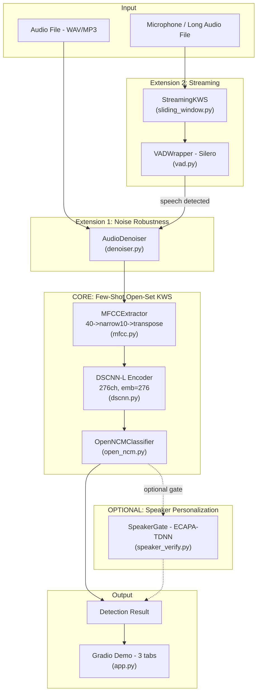
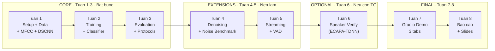
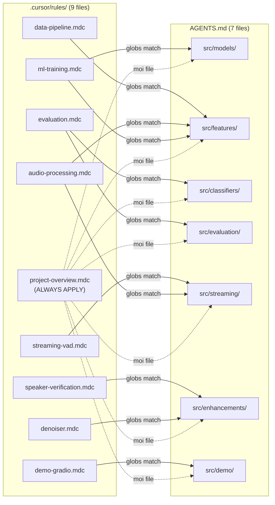

# Enhanced Few-Shot Open-Set Keyword Spotting with Noise-Robust Prototype Classification and Real-Time Streaming Inference

## 1. Tong Quan Du An

**De tai**: Enhanced Few-Shot Open-Set Keyword Spotting with Noise-Robust Prototype Classification and Real-Time Streaming Inference

**Phuong an**: **B+** (Core research + 2 extensions + 1 optional) -- Can bang giua chat luong hoc thuat va kha nang demo.

**Co so khoa hoc**: Luan van "Enhanced Evaluation Protocols for Few-Shot Open-Set KWS Systems" (Phan Thanh Binh, USTH 2025), xay tren bai bao cua Rusci et al. (2023).

**Code tham khao**: [mrusci/ondevice-fewshot-kws](https://github.com/mrusci/ondevice-fewshot-kws)

**Dong gop cot loi** (cau tra loi cho hoi dong khi hoi "Dong gop cua em la gi?"):

1. De xuat va trien khai co che phan lop prototype-based voi Direct L2 distance cho bai toan few-shot open-set KWS, loai bo rang buoc probability normalization
2. Danh gia tac dong cua noise robustness thong qua noise augmentation khi training va denoising preprocessing khi inference
3. Mo rong he thong tu offline inference sang streaming setting voi VAD va sliding-window detection
4. (Optional) Tich hop speaker verification gate de ca nhan hoa he thong KWS

**Thoi gian**: 1-2 thang | **GPU**: Server/Cloud (Colab/Kaggle)

**Scope da dieu chinh**: Bo cross-lingual experiments (rui ro cao, chua du thiet ke thi nghiem). Giu speaker verification la optional extension. Gradio 3 tabs thay vi 4.

---

## 2. Kien Truc He Thong




Ghi chu so do: Duong lien (-->) la luong bat buoc. Duong dut (-.->) la optional (speaker verify). He thong hoat dong binh thuong khi khong co SpeakerGate.

---

## 3. Cau Truc Thu Muc Du An

```
DoAnTotNghiep/
├── .cursor/rules/                    # 9 Cursor Rules (AI coding guidelines)
│   ├── project-overview.mdc          # [ALWAYS APPLY] Tong quan, conventions
│   ├── ml-training.mdc               # DSCNN + Triplet Loss training rules
│   ├── audio-processing.mdc          # MFCC, audio format, noise augmentation
│   ├── evaluation.mdc                # Direct L2 distance, metrics, protocols
│   ├── data-pipeline.mdc             # Dataset download, loading, filtering
│   ├── denoiser.mdc                  # AudioDenoiser interface + benchmarks
│   ├── speaker-verification.mdc      # SpeakerGate interface + integration
│   ├── streaming-vad.mdc             # VAD + StreamingKWS specs + latency
│   └── demo-gradio.mdc              # Gradio UI structure + guidelines
│
├── configs/
│   └── default.yaml                  # Tat ca hyperparameters tap trung
│
├── data/
│   ├── download_gsc.py               # Script download GSC v2 (~2.3GB)
│   ├── download_mswc.py              # Script download MSWC subset
│   ├── gsc_v2/                       # 35 word folders + _background_noise_/
│   ├── mswc_en/                      # 763 words (450 train + 50 val + 263 eval)
│   ├── convert_opus.py               # Convert MSWC OPUS->WAV (Windows ffmpeg fallback)
│   └── demand/                       # DEMAND noise WAV files
│
├── src/
│   ├── features/                     # AGENTS.md: MFCCExtractor + NoiseAugmenter
│   │   ├── mfcc.py                   # MFCCExtractor class
│   │   └── augmentation.py           # NoiseAugmenter class
│   │
│   ├── models/                       # AGENTS.md: DSCNN + TripletLoss + training
│   │   ├── dscnn.py                  # DSCNN class (L/S variants, 3 modes)
│   │   └── prototypical.py           # EpisodicBatchSampler + TripletLoss
│   │
│   ├── classifiers/                  # AGENTS.md: OpenNCMClassifier
│   │   └── open_ncm.py              # Direct L2 distance + threshold calibration
│   │
│   ├── evaluation/                   # AGENTS.md: Metrics + Protocols
│   │   ├── metrics.py                # DET curves, AUC, ACC@FAR, FRR@FAR
│   │   └── protocols.py              # GSC Fixed, GSC Rand, MSWC Rand
│   │
│   ├── streaming/                    # AGENTS.md: VAD + Streaming engine
│   │   ├── vad.py                    # VADWrapper (Silero VAD)
│   │   └── sliding_window.py         # StreamingKWS pipeline
│   │
│   ├── enhancements/                 # AGENTS.md: Denoiser + Speaker Gate
│   │   ├── denoiser.py               # AudioDenoiser (spectral/speechbrain/none)
│   │   └── speaker_verify.py         # SpeakerGate (ECAPA-TDNN, 192-dim)
│   │
│   └── demo/                         # AGENTS.md: Gradio web app
│       └── app.py                    # 3 tabs: Offline, Enrollment, Settings+Streaming
│
├── scripts/
│   ├── train.py                      # CLI training script
│   ├── evaluate.py                   # CLI evaluation script
│   └── export_model.py               # (Optional) Export model for deployment -- no spec yet
│
├── notebooks/
│   ├── 01_data_exploration.ipynb
│   ├── 02_training.ipynb
│   ├── 03_evaluation.ipynb
│   └── 04_demo.ipynb
│
├── tests/                            # Unit tests cho moi module
├── checkpoints/                      # Saved model weights
├── requirements.txt
└── README.md
```

---

## 4. He Thong Rules va Agents

### 4.1 Cursor Rules (`.cursor/rules/*.mdc`)

Cursor tu dong load rules khi ban lam viec voi files tuong ung.

#### `project-overview.mdc` -- ALWAYS APPLY

- Python 3.10+, PyTorch 2.0+, type hints, Google-style docstrings
- Audio: 16kHz, 1-second, WAV | MFCC: 40 computed, 10 used (narrow + transpose), 40ms/20ms
- DSCNN-L: 276ch, 5 DS blocks, embedding_dim=276 | Input: (B,1,49,10)
- Training: Triplet Loss, margin=0.5, Adam lr=0.001, StepLR(step_size=20, gamma=0.5)
- Noise: DEMAND, p=0.95, fixed SNR=5dB
- Datasets: GSC v2 (test), MSWC English (train), DEMAND (noise)
- `pathlib.Path` thay vi `os.path`, `torchaudio` la primary

#### `ml-training.mdc` -- Khi lam viec voi `src/models/`, `src/features/`, `scripts/train.py`

- DSCNN-L: 276ch, 1 initial conv + 5 DS blocks, embedding=276, NO Linear projection
- DS Block 5 (cuoi): DW van dung BN+ReLU, chi sau PW dung LayerNorm(elementwise_affine=False)
- L2-norm applied EXTERNALLY (F.normalize in ReprModel)
- Episodic batch: 20 samples x 80 classes, Triplet Loss margin=0.5
- 40 epochs x 400 episodes, Adam lr=0.001, StepLR(step_size=20, gamma=0.5)
- DEMAND noise augmentation: p=0.95, fixed SNR=5dB
- Checkpoint: save state_dict + optimizer + epoch + best metric

#### `audio-processing.mdc` -- Khi lam viec voi `src/features/`, `src/streaming/`

- 16kHz mono, pad/truncate to 1 second, WAV format
- MFCC: compute 40 -> narrow first 10 -> transpose -> (B, 1, 49, 10)
- Flow: MFCC(40) `(1,40,49)` -> narrow(10) `(1,10,49)` -> .mT `(1,49,10)`
- Noise: DEMAND, p=0.95, fixed SNR=5dB
- Streaming: VAD chunk 512 samples (32ms), sliding window 1s/0.5s, ring buffer

#### `evaluation.mdc` -- Khi lam viec voi `src/evaluation/`, `src/classifiers/`

- Direct L2 distance (KHONG dung softmax probability normalization)
- threshold = "acceptance radius" quanh moi prototype
- 3 protocols: GSC Fixed (10+20), GSC Rand (random), MSWC (5+50 tu 263 words)
- Metrics: mean DET curves, AUC, ACC@5%FAR (mandatory 5 runs; extended: +FRR@5%FAR, 10 runs)

#### `data-pipeline.mdc` -- Khi lam viec voi `data/`, `configs/`

- GSC: 35 word folders, hash-based train/dev/test split (8:1:1)
- MSWC: min 1000 utterances/word, loai tru top 500, con 263 words, split 1:9
- AudioDataset: auto-resample to 16kHz, skip corrupted files voi warning

#### `denoiser.mdc` -- Khi lam viec voi `src/enhancements/denoiser.py`

- 3 methods: spectral_gating (noisereduce, CPU), speechbrain (SepformerSeparation, GPU), none
- Benchmark tai SNR 0/5/10/20dB + clean, do KWS accuracy truoc/sau
- Fallback: speechbrain fail -> dung spectral_gating, clamp output [-1, 1]

#### `speaker-verification.mdc` -- Khi lam viec voi `src/enhancements/speaker_verify.py`

- ECAPA-TDNN tu SpeechBrain, embedding 192-dim
- Enroll 3-5 mau -> mean embedding, verify bang cosine similarity > threshold
- Pipeline: KWS detect truoc -> speaker verify sau, fail -> "rejected_wrong_speaker"
- Neu SpeechBrain unavailable -> disable gate, khong block KWS

#### `streaming-vad.mdc` -- Khi lam viec voi `src/streaming/`

- VADWrapper: Silero VAD, chunk 512 samples, threshold 0.5, min_speech 250ms
- StreamingKWS: composes encoder (DSCNN-L, 276ch) + classifier + vad + denoiser? + speaker_gate?
- Latency budget: VAD<5ms, Denoise<30ms, MFCC<5ms, DSCNN<10ms, total<71ms
- `feed_chunk` KHONG BAO GIO raise exception -- catch all, log, return None

#### `demo-gradio.mdc` -- Khi lam viec voi `src/demo/`

- 3 tabs: Offline Detection, Enrollment (few-shot), Settings + Streaming
- Hien thi: keyword + L2 distance + MFCC spectrogram + DET curve
- Color: xanh (detected), do (rejected), xam (unknown)
- Error: "No keywords enrolled", "Audio too short", mic permission

### 4.2 Directory Agents (`AGENTS.md` trong moi thu muc)

Moi AGENTS.md cung cap: **API interface day du**, **error handling**, **test cases mau**.

#### `src/models/AGENTS.md`

```python
# dscnn.py
class DSCNN(nn.Module):
    def __init__(self, model_size: str = "L", feature_mode: str = "NORM"): ...
    def forward(self, x: torch.Tensor) -> torch.Tensor: ...
    # Input: (B, 1, 49, 10) = (batch, channel, T, n_features)
    # Output: (B, 276) for DSCNN-L | L2-norm applied externally

# prototypical.py
class EpisodicBatchSampler:
    def __init__(self, labels, n_classes=80, n_samples=20): ...
class TripletLoss(nn.Module):
    def __init__(self, margin: float = 0.5): ...
def train_one_epoch(encoder, dataloader, optimizer, loss_fn) -> dict: ...
```

#### `src/features/AGENTS.md`

```python
# mfcc.py
class MFCCExtractor:
    def __init__(self, n_mfcc=40, num_features=10, sample_rate=16000,
                 win_length_ms=40, hop_length_ms=20): ...
    def extract(self, waveform: torch.Tensor) -> torch.Tensor: ...      # (1,T) -> (1,49,10)
    def extract_batch(self, waveforms: torch.Tensor) -> torch.Tensor: ... # (B,1,T) -> (B,1,49,10)
    # Flow: MFCC(40) -> narrow(10) -> transpose -> (channel, T, n_features)

# augmentation.py
class NoiseAugmenter:
    def __init__(self, noise_dir: Path, prob: float = 0.95, snr_db: float = 5.0): ...
    def augment(self, waveform: torch.Tensor) -> torch.Tensor: ...
```

#### `src/classifiers/AGENTS.md`

```python
# open_ncm.py
class OpenNCMClassifier:
    def set_prototypes(self, prototypes: torch.Tensor, labels: list[str]) -> None: ...
    def predict(self, query_embedding: torch.Tensor) -> tuple[str, float]: ...
    def calibrate(self, val_embeddings, val_labels, target_far=0.05) -> float: ...
    def get_distances(self, query_embedding: torch.Tensor) -> dict[str, float]: ...
```

#### `src/evaluation/AGENTS.md`

```python
# metrics.py
def compute_det_curve(y_true, scores) -> tuple[np.ndarray, np.ndarray]: ...
def compute_mean_det(y_true_per_class, scores_per_class) -> tuple: ...
def compute_auc(y_true, scores) -> float: ...
def compute_acc_at_far(y_true, y_pred, scores, target_far=0.05) -> float: ...
def compute_frr_at_far(y_true, scores, target_far=0.05) -> float: ...
def plot_det_curves(curves: dict[str, tuple], save_path=None) -> None: ...

# protocols.py
class EvaluationProtocol:
    def __init__(self, dataset="gsc", mode="fixed", n_runs=5): ...  # 5 mandatory, 10 extended
    def get_partitions(self, run_idx) -> tuple[list[str], list[str]]: ...
    def evaluate(self, encoder, classifier, data_loader) -> dict: ...
```

#### `src/streaming/AGENTS.md`

```python
# vad.py
class VADWrapper:
    def process_chunk(self, chunk: torch.Tensor) -> bool: ...  # (512,) -> bool
    def get_speech_probability(self, chunk) -> float: ...
    def reset(self) -> None: ...

# sliding_window.py
class StreamingKWS:
    def __init__(self, encoder, classifier, vad, denoiser=None, speaker_gate=None,
                 window_size=16000, stride=8000): ...
    def feed_chunk(self, chunk) -> dict | None: ...
    # Returns: {'keyword': str, 'confidence': float, 'speaker_verified': bool, 'timestamp_ms': int}
    def start(self) -> None: ...
    def stop(self) -> list[dict]: ...
```

Pipeline: Audio chunk -> VAD -> Ring buffer -> Denoise -> MFCC -> DSCNN -> Classify -> Speaker verify -> Result

#### `src/enhancements/AGENTS.md`

```python
# denoiser.py
class AudioDenoiser:
    def __init__(self, method="spectral_gating", device="cpu"): ...  # spectral_gating|speechbrain|none
    def denoise(self, waveform: torch.Tensor, sr=16000) -> torch.Tensor: ...  # (1,T) -> (1,T)
    def benchmark(self, clean, noisy) -> dict: ...

# speaker_verify.py
class SpeakerGate:
    def __init__(self, threshold=0.25, device="cpu"): ...  # ECAPA-TDNN, 192-dim
    def enroll(self, audio_samples: list[torch.Tensor]) -> None: ...
    def verify(self, query_audio) -> tuple[bool, float]: ...  # (is_owner, cosine_similarity)
    def save_profile(self, path) -> None: ...
    def load_profile(self, path) -> None: ...
    @property
    def is_enrolled(self) -> bool: ...
```

Ca hai module deu OPTIONAL: co the None trong pipeline, fail gracefully, toggle on/off tai runtime.

#### `src/demo/AGENTS.md`

```python
# app.py
def create_app(encoder, classifier, vad=None, denoiser=None, speaker_gate=None) -> gr.Blocks: ...
def offline_tab() -> gr.Tab: ...      # Upload audio -> detect keyword + MFCC viz + distances
def enrollment_tab() -> gr.Tab: ...   # Record 3-5 mau -> register keyword (few-shot)
def settings_tab() -> gr.Tab: ...     # Threshold, denoising, shot count, speaker gate, optional streaming
```

---

## 5. Thong So Ky Thuat Quan Trong

### Audio

- Sample rate: **16kHz** | Duration: **1 second** | Format: **WAV** (mono)
- Pad zeros neu < 1s, truncate neu > 1s

### MFCC

- Compute **40** Mel coefficients, keep only first **10** (via `torch.narrow`)
- Window: **40ms** (640 samples) | Hop: **20ms** (320 samples)
- Preprocessing flow: MFCC(40) `(1,40,49)` -> narrow(10) `(1,10,49)` -> transpose `(1,49,10)`
- Final output: **(1, 49, 10)** = (channel, T_frames, n_features) cho 1-second audio

### DSCNN-L (theo Rusci et al. `model_size_info_DSCNNL`)

- **276 channels** | 1 initial conv + **5 DS blocks** | **embedding_dim=276**
- Initial: Conv2d(1, 276, kernel=(10,4), stride=**(2,1)**) + BN + ReLU
- DS Block 1: stride=(2,2) | DS Blocks 2-5: stride=(1,1)
- DS Blocks 1-4: DW + BN + ReLU + PW + BN + ReLU
- DS Block 5: DW + BN + ReLU + PW + LayerNorm(elementwise_affine=False)
- Final: AvgPool -> Flatten -> output **(B, 276)** -- **KHONG co Linear projection**
- L2-norm applied EXTERNALLY: `F.normalize(embedding, p=2, dim=-1)` trong ReprModel
- 3 modes: CONV, RELU, **NORM** (tot nhat, L2-normalized externally)
- Input: **(B, 1, 49, 10)** = (batch, channel, T, n_features) -- khop MFCCExtractor output
- Output: **(B, 276)** embedding

### Training

- **Triplet Loss** (margin=0.5) -- KHONG dung cross-entropy
- Episodic batch: **20 samples x 80 classes**
- Adam: lr=**0.001**, **StepLR(step_size=20, gamma=0.5)** -- halve LR every 20 epochs
- Tong **40 epochs x 400 episodes**
- Train tren **MSWC English top 450 words** (50 held for val, 263 eval excluded)
- Noise: **DEMAND** dataset, p=0.95, **fixed SNR=5dB** (khong phai range)

### Evaluation

- **Direct L2 distance** (thesis improvement) -- khong dung probability normalization
- Threshold = acceptance radius quanh prototype

**Baseline comparison** (justify contribution #1):

- **Baseline**: Probability-based scoring voi openNCM (Rusci et al. original)
- **Proposed**: Direct L2 distance classification (khong dung probability normalization)
- So sanh: cung model, cung data, chi khac phuong phap scoring -> isolate effect cua thay doi

**Mandatory (bat buoc)**:

- GSC Fixed protocol + GSC Randomized protocol
- Metrics: mean DET curves, AUC, ACC@5%FAR
- Trung binh tren 5 runs

**Extended (neu du thoi gian)**:

- MSWC Randomized protocol (263 words, 5 positive + 50 negative)
- Them FRR@5%FAR day du
- Tang len 10 runs cho statistical reliability

### GSC Word Partitions

- **GSC+ (10 positive)**: yes, no, up, down, left, right, on, off, stop, go
- **GSC- (20 negative)**: 20 remaining words
- **Excluded (5)**: backward, forward, visual, follow, learn
  - In baseline (probability-based + openNCM): used to compute unknown prototype c0
  - In proposed method (Direct L2): NOT used -- rejection is purely by threshold on min distance
  - Must still download and keep for baseline comparison experiment

### Streaming Latency Budget

**Core pipeline (bat buoc):** 5 + 5 + 10 + 1 = **21ms**

- MFCC: **< 5ms**
- DSCNN inference: **< 10ms**
- Classifier: **< 1ms**
- VAD per 32ms chunk: **< 5ms**

**Voi denoising (EXT-1):** 21 + 30 = **51ms**

- Denoise 1 sec: **< 30ms** (dung spectral_gating cho streaming, SpeechBrain chi cho offline)

**Voi speaker verify (OPTIONAL):** 51 + 20 = **71ms**

- Speaker verify: **< 20ms**

**Target:** < 100ms end-to-end (du room cho overhead)

---

## 6. Lo Trinh Thuc Hien (Plan B+)

### Phan tang uu tien




### Nguyen tac "Cat loss" (theo ChatGPT)

Neu bi tre tien do, cat theo thu tu tu duoi len:

1. **Cat dau tien**: Speaker verification (optional, khong anh huong core)
2. **Cat tiep**: Realtime mic streaming (giu lai sliding window offline la du)
3. **Cat cuoi cung**: Denoising (giu lai noise augmentation khi train la du)
4. **KHONG BAO GIO cat**: Core KWS + Evaluation + Offline demo

### Chi Tiet Tung Tuan

**Tuan 1: Setup + Core Pipeline** (todos: setup, dataset, mfcc, augmentation, dscnn)

- Tao `requirements.txt`, `configs/default.yaml`, README
- Download GSC v2 (~2.3GB) + MSWC English subset + DEMAND noise
- Implement `src/features/mfcc.py` (MFCCExtractor: compute 40 -> narrow 10 -> transpose)
- Implement `src/features/augmentation.py` (NoiseAugmenter, fixed SNR=5dB)
- Implement `src/models/dscnn.py` (DSCNN-L: 276ch, 5 DS blocks, embedding=276)
- Viet unit tests: MFCC shape (1,49,10), DSCNN output shape (B,276), L2 normalization external
- **Milestone**: Co the chay `mfcc -> dscnn -> embedding` cho 1 file WAV, output shape (1,276)

**Tuan 2: Training + Classifier** (todos: training, classifier)

- Implement `src/models/prototypical.py` (TripletLoss + EpisodicBatchSampler)
- Implement `scripts/train.py` -- train DSCNN-L tren MSWC
- Implement `src/classifiers/open_ncm.py` (OpenNCMClassifier + auto_calibrate)
- **Chu y** (theo ChatGPT): Can than voi triplet mining, embedding collapse, L2 norm truoc/sau
- **Milestone**: Train xong, co checkpoint model, co the enroll + predict tren GSC

**Tuan 3: Evaluation + Protocols** (todo: evaluation)

- Implement `src/evaluation/metrics.py` (DET curves, AUC, FAR/FRR)
- Implement `src/evaluation/protocols.py` (3 protocols: GSC Fixed, GSC Rand, MSWC Rand)
- Chay full evaluation, so sanh voi moc tham chieu trong luan van goc (AUC~~0.95, ACC@5%FAR~~0.81). Ky vong ket qua cung xu huong tuong tu, khong nhat thiet phai giong hoan toan.
- Viet analysis: so sanh Direct L2 vs probability-based, fixed vs random protocol
- **Milestone**: Co bang ket qua + DET curves tuong tu Table 4.1 va Figure 4.1 trong luan van

**SAFE STOP POINT**: Sau giai doan Tuan 1-3, de tai da dat duoc mot he thong few-shot open-set KWS hoan chinh voi evaluation day du. Cac phan tu Tuan 4 tro di la mo rong nang cao -- co them thi tot, khong co van du de bao ve.

**Tuan 4: Denoising (Extension 1)** (todo: denoising)

- Implement `src/enhancements/denoiser.py` (spectral_gating + speechbrain + none)
- Benchmark: KWS accuracy o SNR 0dB, 5dB, 10dB, 20dB, clean -- truoc/sau denoising
- Tich hop denoiser vao pipeline (optional step)
- **Milestone**: Co bang so sanh accuracy truoc/sau denoising tai moi muc SNR

**Tuan 5: Streaming + VAD (Extension 2)** (todo: streaming)

- Implement `src/streaming/vad.py` (Silero VAD wrapper)
- Implement `src/streaming/sliding_window.py` (StreamingKWS engine)
- Test: sliding window offline tren audio dai (gia lap streaming)
- Test latency: target < 100ms end-to-end
- **Milestone**: Co the chay KWS tren audio 10-30 giay voi sliding window

**Tuan 6: Speaker Verification (Optional)** (todo: speaker)

- CHI LAM NEU TUAN 1-5 HOAN THANH TOT
- Implement `src/enhancements/speaker_verify.py` (ECAPA-TDNN, SpeakerGate)
- Enrollment 3-5 mau, verify bang cosine similarity
- Tich hop vao pipeline: KWS detect -> speaker verify -> accept/reject
- **Milestone**: Demo "chi chu nhan noi moi hoat dong"

**Tuan 7: Gradio Demo** (todo: demo)

- Implement `src/demo/app.py` voi 3 tabs:
  - Tab 1: Offline KWS (upload audio -> detect + MFCC viz)
  - Tab 2: Enrollment (record 3-5 mau -> register keyword)
  - Tab 3: Settings + Realtime (threshold, denoising toggle, optional mic streaming)
- Xu ly cold start: thong bao "Waiting for Enrollment" khi chua co keyword
- **Milestone**: Demo chay muot, thay/co an tuong

**Tuan 8: Bao Cao + Bao Ve** (todo: docs)

- Viet bao cao tot nghiep (theo cau truc luan van goc)
- Chuan bi slides bao ve
- Chuan bi tra loi cac cau hoi hoi dong (xem muc 10)

---

## 7. Cong Nghe va Thu Vien

- **Framework**: PyTorch 2.0+ (training + inference)
- **Audio I/O**: torchaudio (primary), librosa (fallback), soundfile
- **Feature extraction**: torchaudio.transforms.MFCC
- **VAD**: silero-vad (Silero VAD v6.2.1)
- **Denoising**: noisereduce (CPU, nhanh) + speechbrain (GPU, tot hon)
- **Speaker verification**: speechbrain (ECAPA-TDNN pre-trained VoxCeleb)
- **Web demo**: Gradio
- **Config**: PyYAML
- **Visualization**: matplotlib (DET curves, spectrograms)
- **Tracking**: TensorBoard
- **Testing**: pytest

---

## 8. Rui Ro va Giai Phap

- **Tuan 1 qua nang**: Download MSWC + filtering co the mat 1-2 ngay. **Bat dau download data ngay ngay dau**, song song voi setup code. Xem xet tach tuan 1 thanh 1.5 tuan.
- **MSWC OPUS tren Windows**: torchaudio co the khong decode OPUS truc tiep. **Can cai ffmpeg** truoc hoac convert sang WAV khi download. Them vao data-pipeline.mdc.
- **MSWC dataset qua lon (124GB full)**: Chi download English subset 763 words (~5-10GB).
- **Training time**: DSCNN-L (276ch) lon hon DSCNN-S nhung van la depthwise separable conv, ~4-8h tren T4 GPU. Dung Colab/Kaggle.
- **Colab session timeout**: Checkpoint moi 5 epochs. Resume training bang `--resume checkpoints/latest.pt`. Ghi ro trong scripts/train.py.
- **Triplet Loss kho train / embedding collapse**:
  - Log embedding norms va inter/intra-class distances qua tung epoch
  - Neu loss khong giam sau 10 epochs: thu giam margin tu 0.5 -> 0.3 (margin scheduling)
  - **Fallback**: chuyen sang Prototypical Networks loss (Eq. 2.5 trong thesis) -- van tuong thich voi pipeline
- **Streaming latency**: Silero VAD cuc nhe (32ms/chunk). Core pipeline < 21ms. Tong < 100ms.
- **SpeechBrain models lon**: ECAPA-TDNN ~20MB, Sepformer ~120MB. Download 1 lan, cache local.
- **Denoiser block streaming**: SpeechBrain nang tren CPU. Dung spectral_gating cho streaming, SpeechBrain chi cho offline.

---

## 9. Ban Do Quan He Giua Rules, Agents va Source Files




**Cach hoat dong**: Khi ban mo bat ky file Python nao trong du an:

1. `project-overview.mdc` luon duoc load (alwaysApply: true)
2. Rules co glob pattern khop voi file dang mo se tu dong duoc load
3. AGENTS.md trong cung thu muc voi file dang mo se cung cap context cu the

Vi du: Mo `src/streaming/vad.py` -> Cursor se doc:

- `project-overview.mdc` (luon apply)
- `audio-processing.mdc` (glob khop `src/streaming/**/*.py`)
- `streaming-vad.mdc` (glob khop `src/streaming/**/*.py`)
- `src/streaming/AGENTS.md` (cung thu muc)

---

## 10. Cau Hoi Hoi Dong Co The Hoi (va Cach Tra Loi)

**Q1: Dong gop cot loi cua em la gi?**
A: De tai co 3 dong gop chinh: (1) De xuat co che phan lop prototype-based voi Direct L2 distance, loai bo rang buoc probability normalization, dat ket qua tot hon cach tiep can goc; (2) Danh gia tac dong cua noise robustness thong qua ket hop denoising preprocessing va noise augmentation; (3) Mo rong he thong tu offline sang streaming inference voi VAD va sliding-window detection.

**Q2: Tai sao dung Direct L2 distance ma khong dung softmax probability?**
A: Softmax probability phu thuoc vao gia tri "unknown" distance va mat thong tin ve khoang cach tuyet doi trong embedding space. Direct L2 distance cho phep dien giai threshold nhu "ban kinh chap nhan" quanh moi prototype -- truc quan hon va dat ket qua tot hon trong tham chieu goc (AUC 0.95 vs 0.94, ACC@5%FAR 0.81 vs 0.76).

**Q3: Co data leakage giua train va test khong?**
A: Khong. Encoder duoc huan luyen tren MSWC English (top 500 words). Evaluation duoc thuc hien tren GSC (35 words khac hoan toan). Cac query test khong duoc dung de tao prototype hoac chon threshold. Enrollment, calibration/validation va test su dung cac split tach biet cua GSC.

**Q4: Tai sao chon DSCNN ma khong dung Transformer/Conformer?**
A: DSCNN-L duoc chon vi muc tieu on-device deployment va streaming: 276 channels nhung van nhe vi dung depthwise separable conv, inference < 10ms, phu hop voi thiet bi IoT va rang buoc real-time. Architecture chinh xac theo Rusci et al. de dam bao ket qua comparable. Transformer/Conformer co the manh hon nhung nang gap 10-100x, khong phu hop cho bai toan streaming tren thiet bi han che.

**Q5: Tai sao chon Few-shot (Prototypical Networks) ma khong dung Transfer Learning thong thuong?**
A: Transfer Learning thong thuong van yeu cau mot luong du lieu nhat dinh va phai fine-tune lai tang cuoi cua mo hinh, ton tai nguyen tinh toan. Few-shot voi Prototypical Networks cho phep he thong hoc tu khoa moi NGAY LAP TUC chi voi 3-5 mau ma khong can thay doi trong so mo hinh (frozen encoder), cuc ky phu hop cho ca nhan hoa tren thiet bi di dong.

**Q6: Denoiser co that su cai thien accuracy khong?**
A: Co benchmark cu the tai cac muc SNR 0/5/10/20dB va clean. Ky vong denoising cai thien nhieu nhat o moi truong nhieu cao (SNR 0-5dB). O moi truong sach, denoising co the khong thay doi hoac giam nhe accuracy do artifact.

**Q7: Neu em khong lam xong tat ca thi sao?**
A: De tai co "safe stop point" tai Tuan 3. Chi rieng he thong few-shot open-set KWS + evaluation day du da la mot do an hoan chinh. Denoising va streaming la mo rong nang cao, speaker verification la optional. Moi phan co milestone do luong duoc.

**Q8: Speaker verification hoat dong the nao?**
A: ECAPA-TDNN trich xuat speaker embedding 192-dim tu SpeechBrain (pre-trained tren VoxCeleb). Nguoi dung dang ky giong noi voi 3-5 mau, he thong tinh mean speaker embedding. Khi KWS detect keyword, speaker gate so sanh cosine similarity giua query va enrolled embedding. Chi chap nhan neu similarity > threshold. Day la optional gate -- he thong van hoat dong binh thuong khi khong bat.

**Q9: Tai sao speaker verification la optional ma khong phai core?**
A: Speaker verification la bai toan rieng biet (speaker recognition), khong phai KWS. Viec tich hop no mang lai gia tri ung dung (ca nhan hoa) nhung co 3 rui ro ky thuat: (1) dependency nang (SpeechBrain ~120MB), (2) threshold tuning phuc tap do mismatch moi truong thu am giua enrollment va inference, (3) voi it mau enrollment (3-5), speaker embedding de dao dong. De tai tap trung vao dong gop chinh la few-shot open-set KWS voi Direct L2 distance -- speaker verify la extension de minh hoa kha nang mo rong cua pipeline, khong phai trong tam nghien cuu.

**Q10: Em co so sanh voi baseline cua Rusci et al. khong?**
A: Co. Baseline la phuong phap probability-based scoring voi openNCM classifier cua Rusci et al. (2023). Chung toi dung chinh xac cung architecture (DSCNN-L 276ch, 5 DS blocks, embedding=276, MFCC narrow 10), cung data (MSWC train, GSC test), cung training params (StepLR gamma=0.5, SNR=5dB), chi thay doi phuong phap scoring tu softmax probability sang Direct L2 distance. Thiet ke nay isolate hoan toan effect cua thay doi, cho phep so sanh cong bang va justify contribution #1.

**Q11: Chi bo softmax thi co phai contribution dang ke khong? Improvement nho (AUC 0.01, ACC 0.05).**
A: Contribution khong chi la con so improvement, ma con la:
(1) **Geometric insight**: Direct L2 cho threshold dien giai nhu "ban kinh chap nhan" -- truc quan hon probability, de deploy hon, khong can unknown prototype.
(2) **Improvement lon hon o dieu kien kho**: ACC@5%FAR tang tu 0.76 -> 0.81 la **6.5% tuyet doi** -- kha significant cho bai toan open-set noi accuracy thap.
(3) **Don gian hoa pipeline**: Bo duoc buoc compute unknown prototype (5 excluded words), giam complexity.
(4) Ket hop voi denoising va streaming, tong dong gop la 1 he thong hoan chinh -- khong chi 1 thay doi nho.

**Q12: Workflow chinh la notebook hay scripts?**
A: Scripts cho training/evaluation tren server (train.py, evaluate.py). Notebooks cho exploration va visualization (01-04). Tren Colab dung notebook goi scripts. Local dung CLI.