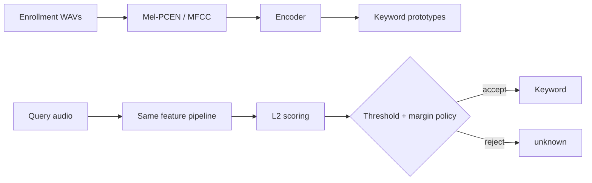
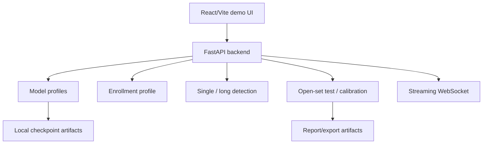
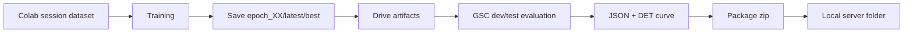
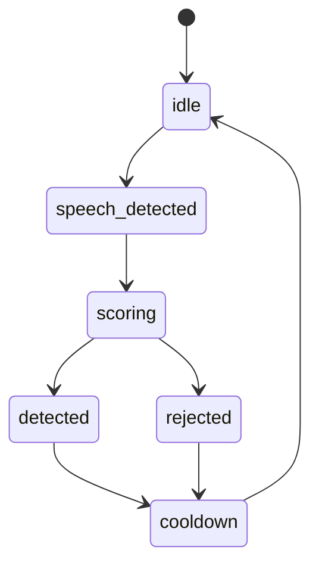

# Technical Manual EN - Few-Shot Open-Set Keyword Spotting

This document is the engineering handbook for the KWS project. It is intentionally detailed: the goal is that another engineer can understand the problem, data, models, training, evaluation, inference, UI, APIs, artifacts, failure modes, and reproduction steps without relying on chat history.

## 1. System Overview

The project implements **few-shot open-set keyword spotting**. A user provides a small number of enrollment samples for each keyword. The backend converts audio to acoustic features, runs an encoder to produce embeddings, averages the enrollment embeddings into class prototypes, and classifies new audio by L2 distance to the prototypes. If the query is too far from all prototypes, or if top-1 and top-2 candidates are too close, the system rejects the query as `unknown`.

High-level flow:

1. Enroll audio samples per keyword.
2. Normalize audio to 16 kHz mono.
3. Extract mel-PCEN features for EdgeSpotFull or MFCC for legacy DSCNN.
4. Encode each sample into a 64-D embedding.
5. Average support embeddings into one prototype per keyword.
6. Score query audio by L2 distance to prototypes.
7. Apply global threshold, optional per-class thresholds, and optional close-word margin guard.
8. Return a keyword or `unknown`.
9. For long audio, segment first and explain each miss.
10. For open-set testing, sample known/unknown GSC words and compute rejection metrics.







## 2. Repository Architecture

| Path | Responsibility | Inputs/Outputs | Current role |
|---|---|---|---|
| `src/models` | Neural encoders | features -> embeddings | DSCNN legacy, EdgeSpotFull current. |
| `src/features` | Audio feature extraction | waveform -> MFCC/mel-PCEN | EdgeSpotFull uses mel-PCEN. |
| `src/classifiers` | Prototype/OpenNCM scoring | embeddings/prototypes -> scores | L2 scoring is the main path. |
| `src/protocols` | Evaluation protocols | datasets/splits -> episodes | GSC exact protocol lives here. |
| `src/streaming` | Enrollment and streaming decisions | chunks/prototypes -> events | Shared by demo and tests. |
| `src/demo` | FastAPI backend, artifacts, UI roots | HTTP/WebSocket | Main demo backend. |
| `src/demo/ui` | React/Vite UI | API responses -> UI | New polished UI. |
| `src/demo/web` | Legacy static UI | browser fallback | Kept for rollback. |
| `scripts` | Training/evaluation/report tools | CLI | Used by Colab and local docs. |
| `configs` | Training configurations | YAML | Microset/Top500 profiles. |
| `tests` | Regression tests | pytest fixtures | API, streaming, open-set. |
| `docs` | Runbooks, thesis, technical docs | Markdown/TeX | Human-facing documentation. |
| `reports` | Generated status/result files | JSON/Markdown | Claim matrix and result story. |
| `server` | Downloaded artifact package | checkpoints/results | Demo artifact source. |

Legacy modules are kept deliberately. DSCNN-L + MFCC + Triplet is still useful as a baseline. The old static web UI is kept as a fallback while the React UI becomes the primary demo interface.

## 3. Dataset Pipeline

### Google Speech Commands v2

GSC is the evaluation and demo dataset. It provides 35 command words and many speakers. The project uses GSC for:

- `gsc_edgespot_exact` evaluation;
- UI enrollment presets;
- long-audio demo generation;
- sampled open-set testing;
- cross-dataset validation of MSWC-trained embeddings.

### MSWC Microset English

Microset is the current thesis anchor. It must be read through official CSV manifests rather than folder scanning because the split is sample-level. Approximate locked counts:

- train: 69,868 WAV;
- dev: 13,114 WAV;
- test: 13,117 WAV;
- total: 96,099 WAV.

Using manifests prevents train/dev/test leakage. This is important because the same keyword classes appear across splits, but audio files differ.

### MSWC Top500

Top500 is the scale-up path after Microset model selection. Target split:

- 450 train words;
- 50 validation words;
- `max_per_word=0` means full clips.

The recommended Colab strategy is **session-first data, Drive-first artifacts**. The dataset can be downloaded/converted in `/content` and used immediately. Checkpoints, result JSON, DET curves, and final zip packages must be saved to Drive. Copying a large WAV cache to Drive is slow and unnecessary for the main artifact story.

### DEMAND Noise

DEMAND is used for noise augmentation. It is not required for GSC evaluation. If DEMAND is absent, evaluation still works, but noise-robustness claims should be avoided unless the training run used the intended noise setup.

## 4. Feature Extraction

The EdgeSpotFull path uses:

```text
waveform -> 16 kHz mono -> trim/pad 1 s -> mel spectrogram 40x101 -> PCEN -> encoder -> 64-D embedding
```

Key shapes:

- waveform: 16,000 samples for a one-second clip;
- mel input: `(B, 1, 40, 101)`;
- embedding: `(B, 64)`.

MFCC remains for the DSCNN legacy baseline. Mel-PCEN is preferred for EdgeSpotFull because it keeps the time-frequency structure needed by the CNN-style encoder and is more stable under loudness/noise variation.

Common feature bugs:

- wrong sample rate;
- stereo audio not converted to mono;
- overly short clips mostly containing padding;
- clipped microphone recordings;
- segment windows shifted away from the actual keyword;
- inconsistent padding between train and inference.

## 5. Model Architecture

### Baseline

The baseline is DSCNN-L + MFCC + Triplet. It represents the original project direction and remains useful for comparison. It is not the final selected configuration because cross-dataset GSC results and open-set behavior are weaker than the EdgeSpotFull direction.

### Proposed Model

The current selected family is EdgeSpotFull T4:

- EdgeSpot-style compact encoder;
- `tau=4`;
- trainable PCEN front-end;
- BC-ResNet/Fused-BC style blocks;
- temporal modeling;
- 64-D embedding;
- roughly 130,598 parameters.

This project does not claim a complete reproduction of the EdgeSpot paper. It implements an EdgeSpot-style encoder and extends it for the project objective.

### Losses

| Loss | Purpose |
|---|---|
| Triplet | Baseline metric learning. |
| SCAF | Sub-center ArcFace separation in embedding space. |
| GE2E | Support/query centroid training, close to prototype inference. |
| SCAF+GE2E | Final hybrid direction selected from Microset experiments. |

GE2E is not part of the original EdgeSpot architecture. It is an added project component because few-shot KWS inference resembles verification: a support set forms a centroid, and queries are accepted/rejected by distance.

## 6. Training Pipeline

`scripts/train.py` performs config loading, dataset/manifest loading, episodic sampling, augmentation, model/loss construction, optimizer/scheduler setup, validation, GSC-dev selection, checkpoint saving, and resume handling.

Episodic training parameters:

- `n_classes`: number of classes in an episode;
- `n_samples`: samples per class;
- `episodes`: episodes per epoch.

Microset requires conservative `n_samples` because some words have limited samples. Top500 can use larger episodes when the data is complete.

Top500 Colab policy:

- `--num-workers 100` only in the Top500 Colab runbook;
- reduce to 12 or 20 if the runtime freezes;
- `--save-every 1`;
- `--save-latest-every-epoch`;
- save artifacts to Drive immediately.

Checkpoint meanings:

- `epoch_XX.pt`: auditable checkpoint for a specific epoch;
- `latest.pt`: resume checkpoint;
- `best.pt`: selected checkpoint according to the configured metric.

The project should not rely only on `latest.pt`; epoch checkpoints are needed for recovery and comparison.

## 7. Evaluation Pipeline

Main evaluator: `scripts/evaluate_edgespot_protocol.py`.

Important protocol: `gsc_edgespot_exact`.

Typical settings:

- k-shot = 10;
- dev30 for checkpoint selection or fast comparison;
- test100 for final reporting;
- dev split must not be used as the final claim after tuning.

Metrics:

- `ACC@1%FAR`;
- `ACC@5%FAR`;
- `FRR@5%FAR`;
- AUC;
- EER;
- keyword accuracy;
- precision, recall, F1.

Current evidence:

| Result | Status | Use |
|---|---|---|
| Microset EdgeSpotFull T4 + SCAF+GE2E epoch05 | official locked | thesis main result. |
| Top500 EdgeSpotFull T4 + SCAF+GE2E epoch13 | local artifact | demo and preliminary scale-up analysis. |
| Top500 epoch25 historical run | log/history only | progress story if local artifact is incomplete. |

Microset epoch05 test100:

- ACC@5%FAR: 86.12%;
- KW-ACC: 77.66%;
- F1: 82.41%;
- AUC: 95.61%;
- EER: 11.54%.

Top500 epoch13 dev30:

- ACC@1%FAR: 86.68%;
- ACC@5%FAR: 88.87%;
- AUC: 95.12%;
- F1: 81.71%.

## 8. Inference And Scoring

Pseudocode:

```text
policy = build_detection_policy(threshold, use_per_class, use_close_word_guard)
embedding = encoder(feature(query_audio))
scores = L2(embedding, prototypes)
top1, top2 = two_smallest(scores)
margin = top2.distance - top1.distance
threshold = class_threshold[top1.word] if policy.use_per_class else policy.threshold
accept = top1.distance <= threshold and margin >= policy.accept_margin
return top1.word if accept else "unknown"
```

Important cases:

- Distance below threshold but margin too small means close-word guard rejection.
- Distance above threshold means threshold rejection.
- Expected word not enrolled means the model cannot output that label in the restricted candidate set.
- VAD/segmentation can skip a true keyword entirely.

Guard OFF often improves keyword recognition but worsens unknown rejection. Guard ON is better for a balanced open-set demo.

## 9. Long Audio Detection

The long-audio pipeline:

1. Upload long audio.
2. Optionally upload label TXT.
3. Optionally upload timing JSON.
4. Segment audio with energy/VAD.
5. Score each segment.
6. Match detections to expected timings by maximum overlap.
7. Render summary cards, timelines, detection cards, and missed expected cards.

Accuracy policies:

- all accuracy: all expected timing labels;
- enrolled-only accuracy: only labels that are enrolled;
- timing overlap: a detection is compared with the expected segment that overlaps it most.

Miss reasons:

- no overlap;
- threshold reject;
- guard reject;
- wrong accepted keyword;
- outside enrollment;
- segmentation/cooldown skip.

## 10. Open-Set Test And Calibration

Open-set endpoints:

- `POST /api/open-set/test`;
- `POST /api/open-set/calibrate`.

The main demo preset is GSC 17/17:

- known: `yes, stop, happy, bird, dog, tree, marvin, four, learn, wow, sheila, zero, down, left, right, off, three`;
- unknown: `no, go, up, on, one, two, five, six, seven, eight, nine, bed, cat, house, backward, forward, follow`;
- heldout: `visual`.

Candidate restriction: when this preset is used, only known words are valid candidates. Unknown words are evaluated as reject targets even if prototypes exist elsewhere in the session.

Metrics:

- known tested;
- unknown tested;
- keyword accuracy;
- unknown reject accuracy;
- false accept rate;
- false reject rate;
- open-set accuracy;
- balanced score.

Current empirical recommendation for the demo:

- Guard ON;
- Per-class OFF;
- accept margin 0.05.

Guard OFF can make known keyword accuracy look better, but it accepts too many unknown samples and is not the best balanced setting.

## 11. Streaming System



Streaming inputs are microphone chunks and sliding windows. Outputs are keyword events containing distance, threshold, margin, and timestamp. Streaming is harder than static clips because windows may be misaligned, background noise changes, and cooldown must suppress repeated detections without hiding real repeated commands.

Current limitation: the project has streaming state tests, but not yet a full official microphone benchmark with false alarms per hour and latency distribution.

## 12. FastAPI Backend

Primary backend: `src/demo/api_server.py`.

Endpoint groups:

- model: `/api/model/profiles`, `/api/model/select`, `/api/model/info`;
- enrollment: `/api/enroll/status`, `/api/enroll/gsc`, `/api/enroll/mic`, `/api/enroll/clear`, `/api/enroll/save`, `/api/enroll/load`;
- detection: `/api/detect/single`, `/api/detect/long`, `/api/detect/batch`;
- open-set: `/api/open-set/test`, `/api/open-set/calibrate`;
- artifacts: `/api/artifacts/status`, `/api/export/session-report`;
- streaming: `/ws/stream`.

The response `settings` object is important because the frontend must show the policy actually used by the backend, not a guessed UI state.

## 13. React UI Technical Design

New UI:

- path: `src/demo/ui`;
- stack: React, TypeScript, Vite, CSS design tokens;
- build output: `src/demo/ui/dist`;
- served by FastAPI when `dist` exists;
- legacy fallback: `src/demo/web`.

Panels:

- Enrollment;
- Single Detection;
- Long Audio;
- Open-Set;
- Streaming;
- Model Info;
- Reports.

Accessibility and UX:

- real controls instead of div-click handlers;
- keyboard focus visible;
- alert role for errors;
- dialog role for switch modal;
- responsive layout;
- timelines scroll horizontally inside their own region rather than overflowing the page.

## 14. Artifact And Reproducibility

Generate status:

```bash
python scripts/make_project_status.py
```

Outputs:

- `reports/project_status/artifact_manifest.json`;
- `reports/project_status/result_story_vi.md`;
- `reports/project_status/result_story_en.md`;
- `reports/project_status/claim_matrix.md`.

Colab rule: save checkpoints and result files to Drive before relying on local download. The Top500 artifact story exists because one earlier run was promising but not fully packaged locally. The current safer policy is save every epoch and create a Drive package before closing the session.

## 15. Testing Strategy

Backend:

```bash
python -m py_compile src/demo/api_server.py demo_quick.py
python -m pytest tests/test_demo_api_robust.py tests/test_streaming_state_machine.py tests/test_demo_open_set_api.py -q
```

Frontend:

```bash
cd src/demo/ui
npm install
npm run typecheck
npm run build
```

Docs/status:

```bash
python scripts/make_project_status.py
```

Manual demo acceptance:

1. Start server.
2. Confirm React UI loads.
3. Switch Microset/Top500 model.
4. Enroll GSC 17 known.
5. Run single detection.
6. Run long audio with labels/timing.
7. Run open-set 17/17.
8. Run calibration.
9. Apply best balanced.
10. Export session report.

## 16. Troubleshooting

| Issue | Symptom | Cause | Fix |
|---|---|---|---|
| Missing checkpoint | model card says missing | artifact not downloaded | copy checkpoint to `server` package path. |
| No enrolled keywords | detection fails | enrollment empty | enroll preset or load profile. |
| GSC unknown audio missing | open-set skipped words | local GSC incomplete | set up/download GSC. |
| Label count mismatch | row-wise accuracy skipped | segmentation count differs | use timing JSON and inspect miss cards. |
| Threshold miss | candidate close but rejected | distance above threshold | calibrate threshold. |
| Guard miss | top-1/top-2 too close | accept margin active | use calibration, do not disable guard blindly. |
| Low unknown rejection | many false accepts | threshold loose or guard off | Guard ON, lower threshold, calibrate. |
| Top500 partial cache | word dirs too low | incomplete cache | rebuild session dataset. |
| Colab reset | session dataset lost | runtime ended | rerun setup, resume Drive checkpoint. |
| Units exhausted | run stops at epoch 13 | quota | use saved epoch checkpoint, continue later. |
