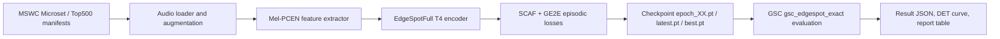
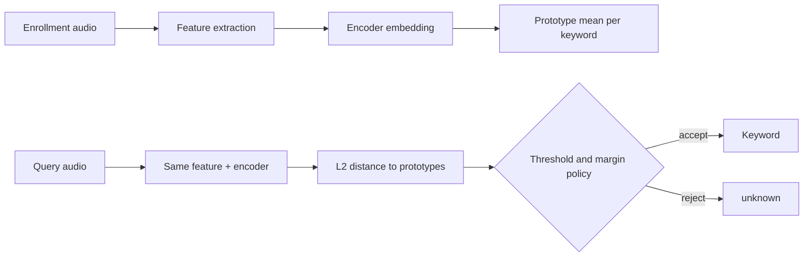
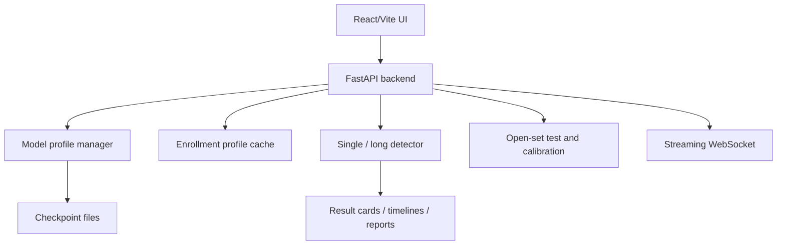
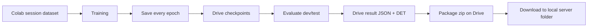
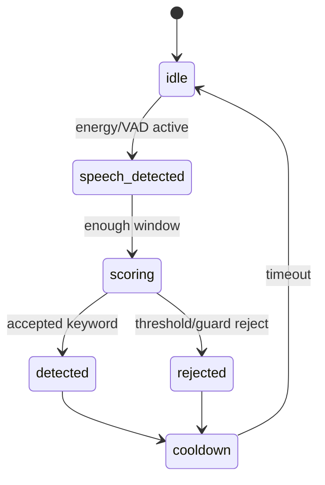

# Technical Manual VI - Few-Shot Open-Set Keyword Spotting

Tài liệu này là bản "engineering handbook" cho dự án KWS. Mục tiêu không phải chỉ giải thích cách bấm demo, mà là ghi lại toàn bộ hệ thống: bài toán, dữ liệu, model, huấn luyện, đánh giá, inference, UI, API, artifact, lỗi đã gặp và cách xử lý. Bản này cố ý viết dài để có thể rút gọn thành appendix hoặc tài liệu bàn giao sau.

## 1. System Overview

Dự án xây dựng hệ thống **few-shot open-set keyword spotting**. Người dùng có thể enroll một số từ khóa bằng vài mẫu audio, hệ thống tạo embedding bằng encoder, lấy trung bình embedding thành prototype, sau đó nhận diện audio mới bằng khoảng cách L2 đến các prototype. Nếu audio quá xa mọi prototype, hoặc top-1 không đủ tách biệt với top-2, hệ thống trả về `unknown`.

Luồng tổng quát:

1. Người dùng enroll nhiều mẫu cho từng keyword.
2. Backend chuẩn hóa audio về 16 kHz, mono, 1 giây.
3. Feature extractor tạo mel-PCEN hoặc MFCC legacy.
4. Encoder sinh embedding 64 chiều.
5. Prototype của mỗi keyword là trung bình embedding của các mẫu support.
6. Khi detect, embedding mới được so với tất cả prototype bằng L2.
7. Detector quyết định keyword hoặc `unknown` bằng threshold, per-class threshold và close-word guard.
8. Long-audio flow thêm segmentation, matching theo timing và giải thích miss.
9. Open-set flow tự lấy mẫu GSC known/unknown để đo khả năng reject.
10. Streaming flow chạy microphone/WebSocket, dùng state machine để tránh detect lặp và reject thiếu ổn định.

### Training And Evaluation Flow



### Inference Flow



### Demo Web Architecture



### Colab Artifact Flow



### Core Terms

| Term | Meaning in this project |
|---|---|
| KWS | Keyword Spotting, phát hiện từ khóa trong audio. |
| Few-shot | Hệ thống nhận từ mới chỉ với vài mẫu enrollment. |
| Enrollment | Quá trình cung cấp mẫu audio cho keyword mới. |
| Prototype | Vector trung bình đại diện cho một keyword. |
| Open-set | Audio có thể thuộc từ không enroll, hệ thống phải reject. |
| FAR | False Accept Rate, tỷ lệ unknown bị nhận nhầm thành keyword. |
| FRR | False Reject Rate, tỷ lệ keyword đúng bị reject thành unknown. |
| EER | Equal Error Rate, điểm FAR và FRR gần bằng nhau. |
| AUC | Diện tích dưới đường cong ROC/DET tùy protocol. |
| F1 | Trung bình điều hòa precision và recall. |
| KW-ACC | Accuracy chỉ xét keyword class. |
| ACC@1%FAR | Open-set accuracy tại false accept rate 1%. |
| ACC@5%FAR | Open-set accuracy tại false accept rate 5%. |
| GSC | Google Speech Commands v2, dùng đánh giá/demo. |
| MSWC | Multilingual Spoken Words Corpus, dùng train Microset/Top500. |
| Microset | MSWC English official small split, mốc thesis chính. |
| Top500 | 500 từ phổ biến MSWC English, hướng mở rộng. |
| SCAF | Sub-center ArcFace loss, tăng separation trong embedding space. |
| GE2E | Generalized End-to-End loss, mô phỏng support/query/prototype. |
| OpenNCM | Open-set nearest class mean classifier. |
| PCEN | Per-Channel Energy Normalization, feature audio robust hơn log-mel thô. |

## 2. Repository Architecture

| Path | Purpose | Used By | Notes |
|---|---|---|---|
| `src/models` | Encoder models: DSCNN, EdgeSpotFull | train, eval, demo | `EdgeSpotFull` là nhánh chính hiện tại. |
| `src/features` | MFCC, mel, PCEN feature extractors | train, inference | MFCC chủ yếu legacy; mel-PCEN dùng cho EdgeSpotFull. |
| `src/classifiers` | Prototype/OpenNCM scoring logic | eval, demo | L2 distance là scorer chính. |
| `src/protocols` | GSC/MSWC protocol helpers | eval scripts | `gsc_edgespot_exact` là protocol quan trọng. |
| `src/streaming` | Enrollment, streaming state machine, robust engine | demo, tests | Nơi chứa logic prototype và streaming decision. |
| `src/demo` | FastAPI backend, artifact helpers, legacy/static UI | demo | `api_server.py` là backend chính; `ui` là React UI mới. |
| `src/demo/ui` | React/Vite TypeScript UI | demo | Build ra `src/demo/ui/dist`, backend serve nếu tồn tại. |
| `src/demo/web` | Legacy static UI | fallback | Giữ lại để rollback khi React chưa build. |
| `scripts` | Train/eval/status/data scripts | Colab, local reports | `train.py`, `evaluate_edgespot_protocol.py`, status scripts. |
| `data` | Local datasets/enrollment profiles | demo/local eval | Có thể thiếu dataset lớn, cần kiểm tra trước khi chạy. |
| `configs` | YAML configs | training | Dùng cho Colab/top500/microset. |
| `tests` | Unit/API/regression tests | CI/manual | Có tests cho demo API, streaming, open-set. |
| `docs` | Runbooks, reports, thesis/manual | thesis/demo | Bản docs mới nằm trong `docs/technical`, `docs/thesis`, `docs/reports`. |
| `reports` | Generated result/status files | report automation | `reports/project_status` sinh từ artifact discovery. |
| `server` | Local downloaded artifacts | demo | Chứa Microset/Top500 checkpoints và results đã tải về. |

### Legacy Boundaries

Các module legacy vẫn được giữ vì có giá trị so sánh:

- `DSCNN + MFCC + Triplet`: baseline ban đầu, dùng để chứng minh hướng mới tốt hơn.
- `src/demo/web`: UI cũ, fallback nếu build React lỗi.
- Một số scripts cũ cho calibration/result table vẫn dùng được, nhưng docs mới nên ưu tiên pipeline FastAPI + React + scripts hiện tại.

## 3. Dataset Pipeline

### Google Speech Commands v2

GSC là dataset đánh giá và demo. Nó có 35 từ lệnh quen thuộc, nhiều speaker, audio ngắn khoảng 1 giây. Project dùng GSC để:

- đánh giá `gsc_edgespot_exact`;
- enroll preset trong UI;
- tạo long audio demo;
- chạy open-set 17 known / 17 unknown;
- kiểm tra cross-dataset generalization từ MSWC sang GSC.

GSC không phải tập train chính trong các experiment Microset/Top500. Nó là proxy deployment vì demo dùng các lệnh giống GSC.

### MSWC Microset English

Microset là mốc thesis chính. Điểm quan trọng nhất là dùng **official CSV split**, không scan trực tiếp folder `clips/<word>`:

- train: khoảng `69,868` WAV;
- dev: khoảng `13,114` WAV;
- test: khoảng `13,117` WAV;
- tổng: khoảng `96,099` WAV.

Lý do dùng manifest:

1. Microset split là sample-level, cùng keyword có mặt ở train/dev/test nhưng file khác nhau.
2. Nếu scan folder trực tiếp, rất dễ lấy lẫn dev/test vào train.
3. Manifest giúp reproduce số mẫu, kiểm tra thiếu file và debug leakage.

### MSWC Top500 Full

Top500 là hướng mở rộng sau khi Microset cho thấy cấu hình tốt:

- target: 450 train words + 50 val words;
- `max_per_word=0` nghĩa là dùng full clips, không giới hạn số file mỗi từ;
- dataset session-first trên Colab: tải/convert trong `/content`, không bắt buộc copy cache WAV hơn 100 GB lên Drive;
- checkpoint/result vẫn lưu vào Drive sau mỗi epoch để tránh mất run khi Colab reset.

Lý do không copy toàn bộ cache lên Drive mặc định:

- Drive copy chậm;
- quota và I/O Drive dễ nghẽn;
- Colab session có disk tạm đủ cho một lần train;
- thứ cần giữ lâu dài là checkpoint, result JSON, DET curve, package zip.

### DEMAND Noise

DEMAND dùng cho noise augmentation trong training. Nó không bắt buộc cho GSC evaluation. Nếu thiếu DEMAND:

- training vẫn có thể chạy nếu config tắt noise augmentation hoặc bỏ qua noise;
- eval GSC vẫn chạy;
- kết quả robust-noise không nên claim nếu không dùng noise setup đúng.

### Dataset Troubleshooting

| Symptom | Cause | Verify | Fix |
|---|---|---|---|
| `missing WAV` | Manifest trỏ file chưa convert/tải | count manifest vs clips | chạy lại setup/convert. |
| coverage thấp | Drive cache partial hoặc session download thiếu | scan word dirs | xóa cache partial, dùng session-first. |
| còn OPUS | convert chưa xong | `rg --files -g "*.opus"` | convert tiếp hoặc xóa sau convert. |
| word dirs thấp hơn 490 | chỉ tải một phần Top500 | count folder | chạy lại setup không dùng cache cũ. |
| sample count không đủ | keyword ít mẫu, ví dụ `sheila` trong GSC | check per-word count | giảm `n_samples` hoặc bỏ keyword khỏi preset đó. |
| Colab reset | session mất dataset | Drive checkpoint còn | resume sau khi setup dataset lại. |

## 4. Feature Extraction

Pipeline audio chuẩn:

1. Load audio bằng `torchaudio`.
2. Resample về 16 kHz.
3. Convert mono bằng trung bình channel nếu cần.
4. Trim hoặc pad về 1 giây trong static clip.
5. Tạo mel spectrogram 40 bands x 101 frames.
6. Áp dụng PCEN trong nhánh EdgeSpotFull.
7. Đưa tensor dạng `(B, 1, 40, 101)` vào encoder.
8. Encoder output embedding 64-D.

MFCC legacy vẫn tồn tại cho DSCNN baseline. EdgeSpotFull dùng mel-PCEN vì:

- giữ cấu trúc phổ-thời gian tốt hơn cho CNN;
- PCEN ổn định hơn log-mel khi âm lượng/speaker/noise thay đổi;
- shape 40x101 phù hợp với kiến trúc EdgeSpot-style.

### Static, Long, Streaming Difference

| Mode | Input | Feature window | Risk |
|---|---|---|---|
| Static single clip | 1 file ngắn | trim/pad 1s | file quá ngắn hoặc im lặng. |
| Long audio | nhiều segment VAD/energy | từng segment pad/trim | segmentation lệch hoặc bỏ sót. |
| Streaming | microphone chunks | sliding/state windows | latency, cooldown, repeated detection. |

### Common Feature Bugs

- Sample rate sai làm pitch/time scale lệch.
- Audio quá ngắn bị pad quá nhiều silence.
- Audio clipping làm PCEN/mel méo.
- Multi-channel không convert mono dẫn đến shape lỗi.
- Long audio segment quá ngắn làm embedding không ổn định.
- Padding không nhất quán giữa training và inference làm distance tăng.

## 5. Model Architecture

### Baseline: DSCNN-L + MFCC + Triplet

Baseline ban đầu dùng DSCNN-L nhận MFCC, train bằng triplet loss. Vai trò của baseline:

- tạo mốc so sánh với pipeline cũ;
- chứng minh vấn đề open-set không chỉ là UI/threshold;
- giúp report có câu chuyện cải tiến rõ ràng.

Baseline không phải lựa chọn cuối vì embedding separation và cross-dataset GSC yếu hơn cấu hình EdgeSpotFull T4 + SCAF+GE2E.

### Proposed: EdgeSpotFull T4

Model chính hiện tại:

- `EdgeSpotFull`;
- `edge_tau=4`;
- input mel-PCEN `(1, 40, 101)`;
- embedding 64-D;
- khoảng `130,598` parameters;
- backbone kiểu BC-ResNet/Fused BC-ResNet;
- có thành phần temporal để học pattern theo thời gian.

Không claim đây là reproduction đầy đủ EdgeSpot paper. Đây là nhánh EdgeSpot-style trong project, dùng để giải bài toán few-shot open-set KWS với tài nguyên hiện có.

### Losses

| Loss | Role | Notes |
|---|---|---|
| Triplet | Baseline metric learning | Dễ hiểu nhưng separation chưa đủ ổn định. |
| SCAF | Tách class bằng angular margin và sub-centers | Hợp với speaker/accent variation. |
| GE2E | Mô phỏng support/query centroid | Gần với inference bằng prototype. |
| SCAF+GE2E | Hybrid hiện tại | Vừa tách class, vừa học đúng cơ chế few-shot. |

GE2E không phải thành phần gốc EdgeSpot paper. Đây là cải tiến thêm trong đồ án để training gần hơn với cách hệ thống chạy khi người dùng enroll vài mẫu.

### Model Table

| Model | Input | Loss | Params | Dataset | Checkpoint | Role |
|---|---|---|---:|---|---|---|
| DSCNN-L | MFCC | Triplet | small | MSWC/GSC experiments | legacy | baseline |
| EdgeSpotFull T4 | mel-PCEN | SCAF | ~130k | Microset | experiment | ablation |
| EdgeSpotFull T4 | mel-PCEN | SCAF+GE2E | ~130k | Microset | epoch05 | thesis main |
| EdgeSpotFull T4 | mel-PCEN | SCAF+GE2E | ~130k | Top500 | epoch13 | demo/preliminary |

## 6. Training Pipeline

`scripts/train.py` thực hiện:

1. Load YAML config và CLI overrides.
2. Khởi tạo feature extractor và model family.
3. Load word splits hoặc manifest.
4. Tạo episodic sampler.
5. Áp dụng augmentation: noise, SpecAugment nếu bật.
6. Tính loss modules: SCAF, GE2E, KD nếu có.
7. Optimizer Adam và scheduler CosineAnnealingWarmRestarts.
8. Validate theo episodic validation.
9. Chọn checkpoint bằng GSC-dev nếu `--select-by-gsc-dev`.
10. Save `epoch_XX.pt`, `latest.pt`, `best.pt`.

### Episodic Training

Một episode gồm:

- `n_classes`: số class/từ trong episode;
- `n_samples`: số mẫu mỗi class;
- `episodes_per_epoch`: số episode mỗi epoch.

Episodic training quan trọng vì inference cũng là support/query/prototype, không phải classifier cố định.

### Microset Training Notes

Microset có số keyword ít hơn và một số từ ít mẫu. `n_samples` cần chọn thấp hơn Top500 để tránh DataLoader lỗi vì từ không đủ file. Vấn đề điển hình là keyword có ít mẫu như `sheila` trong GSC demo preset, khi sample quá nhiều sẽ không đủ audio.

### Top500 Training Notes

Top500 run dùng Colab/A100 khi có tài nguyên:

- `--num-workers 100` theo yêu cầu demo/Colab Top500;
- PyTorch có thể warning suggested max worker thấp hơn;
- nếu runtime freeze hoặc I/O chậm, giảm về 12 hoặc 20;
- `--save-every 1`;
- `--save-latest-every-epoch`;
- checkpoint lưu Drive sau từng epoch.

### Checkpoint Policy

| File | Meaning | Use |
|---|---|---|
| `epoch_XX.pt` | checkpoint cụ thể theo epoch | tốt nhất cho audit và so sánh. |
| `latest.pt` | checkpoint mới nhất | resume nhanh, nhưng không đủ để audit toàn bộ. |
| `best.pt` | tốt nhất theo metric selection | dùng khi selection đáng tin. |

Save checkpoint qua file tạm rồi replace giúp giảm rủi ro file hỏng khi Colab reset.

### Failure Modes

- Resume đúng cuối epoch từng gây `UnboundLocalError`: cần script thoát sạch nếu đã hoàn tất.
- Colab reset làm mất dataset session nhưng checkpoint Drive vẫn còn.
- Hết units làm run dừng ở epoch 13.
- Drive copy quá lâu khi cố lưu toàn bộ Top500 WAV.
- Worker 100 có thể nhanh hơn hoặc chậm hơn tùy runtime và I/O.

## 7. Evaluation Pipeline

Script chính: `scripts/evaluate_edgespot_protocol.py`.

Protocol quan trọng: `gsc_edgespot_exact`.

Thông số thường dùng:

- `k-shot=10`;
- `n-runs=30` cho dev/sơ bộ;
- `n-runs=100` cho test/final hơn;
- `gsc-query-split=dev` để chọn checkpoint;
- `gsc-query-split=test` để báo cáo cuối.

### Metrics

| Metric | Meaning |
|---|---|
| Open-set ACC | Accuracy tổng trong setting có unknown. |
| KW-ACC | Accuracy trên keyword known. |
| ACC@1%FAR | Open-set accuracy khi FAR cố định 1%. |
| ACC@5%FAR | Open-set accuracy khi FAR cố định 5%. |
| FRR@5%FAR | Tỷ lệ keyword bị reject tại FAR 5%. |
| AUC | Khả năng phân tách score qua threshold. |
| EER | Điểm cân bằng false accept và false reject. |
| Precision/Recall/F1 | Chất lượng detect theo label accepted/rejected. |

Dev dùng để chọn checkpoint. Test100 không dùng để tune. Open-set metrics quan trọng hơn keyword-only accuracy vì hệ thống phải biết từ chối từ lạ.

### Current Result Story

| Result | Status | Main Use |
|---|---|---|
| Microset EdgeSpotFull T4 + SCAF+GE2E epoch05 | official locked | mốc thesis chính. |
| Top500 EdgeSpotFull T4 + SCAF+GE2E epoch13 | local artifact | demo và phân tích sơ bộ. |
| Top500 epoch25 historical run | log/history only | mô tả tiến độ, không claim final nếu thiếu artifact. |

Microset test100:

- ACC@5%FAR: `86.12%`;
- KW-ACC: `77.66%`;
- F1: `82.41%`;
- AUC: `95.61%`;
- EER: `11.54%`.

Top500 epoch13 dev30:

- ACC@1%FAR: `86.68%`;
- ACC@5%FAR: `88.87%`;
- FRR@5%FAR: `20.36%`;
- AUC: `95.12%`;
- F1: `81.71%`.

## 8. Inference And Scoring

Enrollment:

```text
for each keyword:
  load k audio samples
  feature = mel_pcen(audio)
  embedding = encoder(feature)
  prototype[keyword] = mean(embedding)
```

Scoring:

```text
distances = L2(query_embedding, all_prototypes)
top1 = smallest distance
top2 = second smallest distance
margin = top2.distance - top1.distance
threshold = per_class_threshold[top1] if enabled else global_threshold
accept = top1.distance <= threshold and margin >= accept_margin
```

Policy:

- Global threshold: cùng một ngưỡng cho mọi class.
- Per-class threshold: mỗi keyword có ngưỡng riêng.
- Close-word guard: reject nếu top-1 và top-2 quá gần.
- Accept margin: margin tối thiểu khi guard bật.

Cases:

- `distance <= threshold` nhưng `margin < accept_margin`: reject do close-word guard.
- `distance > threshold`: reject do threshold.
- top-1 sai nhưng accepted: false accept hoặc wrong keyword.
- expected word not enrolled: model không thể predict từ đó nếu candidate set không chứa nó.
- VAD skips segment: không có detection overlap với label đúng.

Tắt guard thường làm keyword ACC tăng vì ít reject hơn, nhưng unknown rejection giảm mạnh vì unknown dễ bị nhận nhầm thành keyword gần nhất.

## 9. Long Audio Detection

Pipeline:

1. Upload long WAV.
2. Optional upload `labels.txt`.
3. Optional upload `timings.json`.
4. Segment bằng energy hoặc VAD.
5. Mỗi segment được pad/trim và score.
6. UI render expected timeline, detected timeline, detection cards và missed expected cards.

Ground truth:

- TXT labels chỉ có thứ tự từ.
- Timing JSON có `label`, `start_sec`, `end_sec`.
- Nếu có timing, matching dựa trên overlap lớn nhất giữa detection segment và expected timing.

Accuracy policies:

- All accuracy: đúng trên toàn bộ expected timing.
- Enrolled-only accuracy: bỏ qua expected label chưa enroll.
- Timing overlap accuracy: detection được gán expected theo overlap.

Miss reasons:

- no overlap: segmentation không bắt được đoạn đó.
- rejected threshold: top-1 có thể đúng nhưng distance quá xa.
- rejected guard: top-1/top-2 quá gần.
- wrong prediction: top-1 accepted nhưng sai label.
- outside enrollment: label đúng không nằm trong keyword enrolled.

Known limitations:

- Concatenated GSC clips dễ hơn speech thật.
- VAD có thể split word thành nhiều phần hoặc merge hai word.
- Timing mismatch làm row-wise accuracy thấp dù model nhận đúng gần đó.

## 10. Open-Set Test And Calibration

Endpoints:

- `/api/open-set/test`;
- `/api/open-set/calibrate`.

Preset chính:

- 17 known: `yes, stop, happy, bird, dog, tree, marvin, four, learn, wow, sheila, zero, down, left, right, off, three`;
- 17 unknown: `no, go, up, on, one, two, five, six, seven, eight, nine, bed, cat, house, backward, forward, follow`;
- holdout: `visual`.

Candidate label restriction rất quan trọng: unknown words không được coi là candidate labels, ngay cả khi global enrollment session từng có prototype của chúng. Khi test split 17/17, model chỉ được chọn trong 17 known words hoặc reject `unknown`.

Metrics:

- known tested;
- unknown tested;
- keyword accuracy;
- unknown reject accuracy;
- false accept rate;
- false reject rate;
- open-set accuracy;
- balanced score = `0.5 * keyword_acc + 0.5 * unknown_reject_acc`.

Calibration grid:

- threshold `0.10 -> 1.20`;
- accept margin `0.00, 0.02, 0.05, 0.08, 0.10`;
- per-class ON/OFF;
- close-word guard ON/OFF.

Tie-break:

1. balanced score cao hơn;
2. FAR thấp hơn;
3. false reject thấp hơn;
4. keyword ACC cao hơn.

Kết luận demo hiện tại: **Guard ON + Per-class OFF + accept margin 0.05** là lựa chọn cân bằng nhất. Guard OFF có thể tăng nhận diện keyword nhưng chấp nhận unknown quá nhiều.

## 11. Streaming System

Streaming state machine:



Inputs:

- microphone chunks;
- sliding window;
- VAD/energy activity;
- current enrollment prototypes.

Outputs:

- keyword or unknown;
- distance;
- threshold;
- margin;
- timestamp;
- start/end if available.

Streaming khó hơn static vì window có thể lệch tâm keyword, silence/noise thay đổi liên tục, và cooldown cần tránh detect lặp cùng một từ.

Tests cần có:

- fake embeddings;
- cooldown prevents repeat;
- margin reject;
- silence no crash.

Limitations:

- chưa có benchmark microphone chính thức;
- cần đo false alarm/hour;
- cần đo latency từ speech onset đến detection.

## 12. FastAPI Backend

Backend chính: `src/demo/api_server.py`.

Endpoint groups:

| Group | Endpoints |
|---|---|
| Model | `/api/model/profiles`, `/api/model/select`, `/api/model/info` |
| Enrollment | `/api/enroll/status`, `/api/enroll/gsc`, `/api/enroll/mic`, `/api/enroll/clear`, `/api/enroll/save`, `/api/enroll/load` |
| Detection | `/api/detect/single`, `/api/detect/long`, `/api/detect/batch` |
| Open-set | `/api/open-set/test`, `/api/open-set/calibrate` |
| Artifacts | `/api/artifacts/status`, `/api/export/session-report` |
| Streaming | `/ws/stream` |

Common request fields:

- `threshold`;
- `use_per_class`;
- `use_close_word_guard`;
- `accept_margin`;
- `seed`;
- `samples_per_word`;
- `known_words`;
- `unknown_words`.

Response should expose `settings` so frontend is not guessing what policy backend actually used.

Model switch behavior:

- `enrollment_policy=rebuild`: reload encoder, rebuild prototype from waveform cache if available.
- `enrollment_policy=clear`: clear enrollment.
- if no waveform cache, user must enroll again.

## 13. React UI Technical Design

New UI path: `src/demo/ui`.

Stack:

- React;
- TypeScript;
- Vite;
- CSS design tokens;
- typed API client.

Backend serving rule:

- if `src/demo/ui/dist/index.html` exists, FastAPI serves React UI at `/`;
- otherwise fallback to `src/demo/web/index.html`.

Panels:

- Enrollment;
- Single Detection;
- Long Audio;
- Open-Set;
- Streaming;
- Model Info;
- Reports/Export.

UX states:

- idle;
- loading/busy;
- success result;
- warning;
- error;
- empty enrollment.

Accessibility:

- visible focus state;
- buttons use real `<button>`;
- form labels wrap controls;
- modal uses `role="dialog"` and `aria-modal`;
- result errors use `role="alert"`;
- layout avoids horizontal page overflow.

Why React/Vite:

- old JS grew too large and state coupling became risky;
- TypeScript catches API shape mismatches;
- component boundaries make long-audio/open-set UI easier to maintain;
- build output can be served by FastAPI without a separate production server.

## 14. Artifact And Reproducibility

Artifact categories:

- checkpoint `.pt`;
- result JSON;
- DET curve PNG;
- result tables;
- report Markdown;
- screenshots;
- package zip.

Local artifact status is generated by:

```bash
python scripts/make_project_status.py
```

Outputs:

- `reports/project_status/artifact_manifest.json`;
- `reports/project_status/result_story_vi.md`;
- `reports/project_status/result_story_en.md`;
- `reports/project_status/claim_matrix.md`.

Colab checklist:

Before training:

- confirm Drive mounted;
- confirm checkpoint output dir;
- confirm dataset strategy session-first or Drive cache;
- confirm free disk.

During training:

- use `--save-every 1`;
- use `--save-latest-every-epoch`;
- check logs every few epochs;
- do not rely only on final download.

After training:

- evaluate dev/test;
- create package zip in Drive;
- verify zip exists;
- download package to local `server`.

Failure story: một Top500 run từng có log tốt nhưng package local thiếu checkpoint/result đầy đủ. Fix hiện tại là lưu mỗi epoch, lưu latest mỗi epoch, và package lên Drive trước khi download.

## 15. Testing Strategy

Backend:

```bash
python -m py_compile src/demo/api_server.py demo_quick.py
python -m pytest tests/test_demo_api_robust.py tests/test_streaming_state_machine.py tests/test_demo_open_set_api.py -q
```

Frontend:

```bash
cd src/demo/ui
npm install
npm run typecheck
npm run build
```

Docs/status:

```bash
python scripts/make_project_status.py
```

Manual demo checklist:

1. Start server.
2. Open UI.
3. Switch model.
4. Enroll GSC 17 known.
5. Run single detect.
6. Run long audio with labels/timing.
7. Run open-set 17/17.
8. Run calibration.
9. Apply best balanced.
10. Export session report.

## 16. Troubleshooting

| Issue | Symptom | Likely Cause | Fix | Prevention |
|---|---|---|---|---|
| Git not in PATH | commands fail in Windows shell | Git not installed/configured | install Git or use bundled terminal | verify before scripts. |
| Colab reset | dataset gone | session ended | rerun setup, resume checkpoint | save every epoch to Drive. |
| Colab units exhausted | run stops mid epoch | quota | use local artifact checkpoint | schedule shorter runs. |
| checkpoint missing | model card says missing | artifact not downloaded | copy checkpoint to `server` path | package Drive before closing. |
| GSC unknown audio not found | open-set skipped words | local GSC missing words | download/setup GSC | verify `/data/gsc_v2`. |
| no enrolled keywords | detect returns error | enrollment cleared | enroll preset | check status panel. |
| labels count mismatch | row-wise skipped | VAD missed/split segments | use timing JSON | inspect missed cards. |
| miss due threshold | unknown despite close candidate | distance too high | adjust threshold/calibrate | report policy settings. |
| miss due guard | distance ok, margin low | top-1/top-2 too close | disable guard only for keyword demo | use balanced calibration. |
| low unknown rejection | unknown accepted | threshold too loose/guard off | guard ON, lower threshold | use open-set calibration. |
| Top500 cache incomplete | fewer than 490 word dirs | partial Drive/session data | rebuild session dataset | avoid partial cache reuse. |
| worker 100 freeze | DataLoader slow/freezes | too many processes/I/O | lower workers to 12/20 | monitor warning. |
| Drive copy too slow | setup stalls | copying huge WAV cache | session-first dataset | save only artifacts. |
