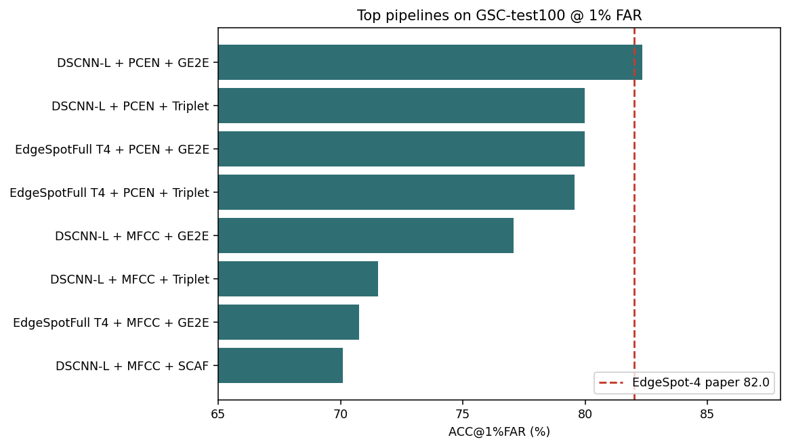
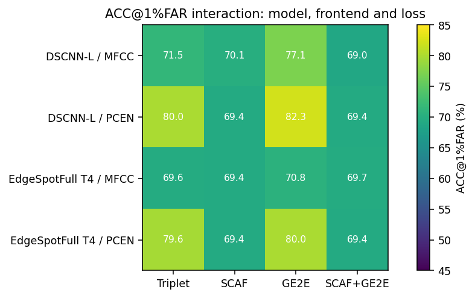
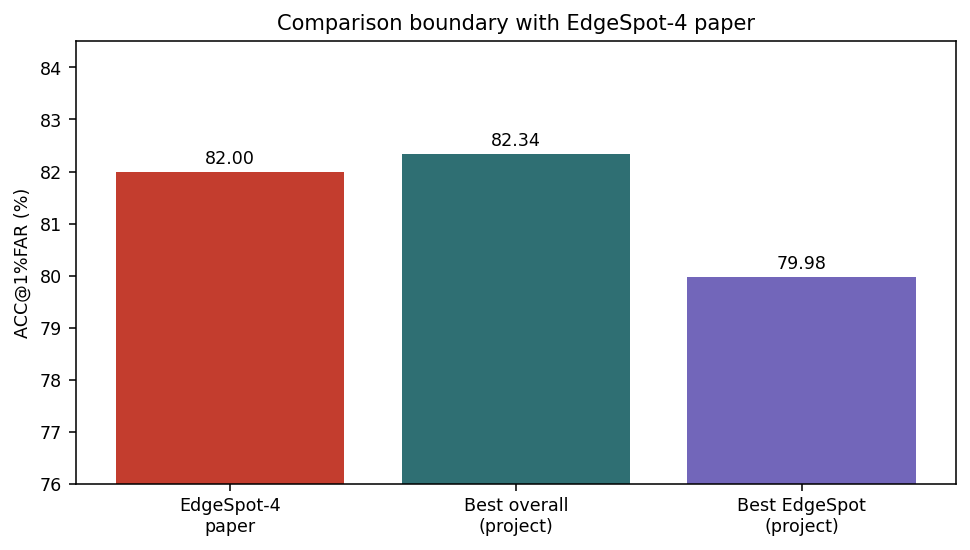

# Few-Shot Open-Set Keyword Spotting dựa trên Embedding và Prototype Inference

Bản thesis tiếng Việt - draft ngày 2026-06-12. Cần cập nhật thông tin bìa theo mẫu chính thức của trường trước khi nộp.

Evidence chính: `results\cap620_16_pipeline_metrics_long.csv` và run `colab_mswc_cap620_flac_16pipe_e40_ep150_20260611_154517`.

## Mục lục gợi ý

1. Giới thiệu
2. Cơ sở lý thuyết và công trình liên quan
3. Thiết kế hệ thống và phương pháp
4. Thực nghiệm
5. Kết quả và thảo luận
6. So sánh với EdgeSpot-4 paper
7. Demo system và triển khai
8. Kết luận và hướng phát triển

# Lời cảm ơn

Em xin gửi lời cảm ơn tới giảng viên hướng dẫn, các thầy cô và các anh chị đã hỗ trợ về chuyên môn, tài nguyên tính toán và góp ý trong quá trình thực hiện đồ án. Các thí nghiệm trong đồ án yêu cầu nhiều lần chạy trên Colab và server, vì vậy sự hỗ trợ về môi trường chạy và phản hồi kỹ thuật có vai trò quan trọng để hoàn thiện kết quả.

Em cũng xin cảm ơn gia đình và bạn bè đã động viên trong quá trình làm việc. Bản thảo này được viết theo hướng có thể tiếp tục chỉnh sửa theo mẫu hình thức của trường, trong đó các phần bìa, thông tin sinh viên và format citation cần được cập nhật theo yêu cầu chính thức trước khi nộp.

# Tóm tắt

Đồ án này nghiên cứu bài toán few-shot open-set keyword spotting (KWS), trong đó hệ thống phải nhận diện các từ khóa mới từ một số ít mẫu enrollment và đồng thời từ chối các âm thanh không thuộc tập từ khóa đã đăng ký. Khác với KWS closed-set, bài toán open-set yêu cầu kiểm soát false acceptance rate (FAR) vì một false accept có thể kích hoạt sai lệnh thoại trong hệ thống thực tế.

Đóng góp thực nghiệm chính của bản thesis là một thí nghiệm fixed 16-pipeline trên MSWC English cap620 FLAC với cùng dữ liệu, cùng lịch huấn luyện và cùng protocol đánh giá. Run `colab_mswc_cap620_flac_16pipe_e40_ep150_20260611_154517` tạo 48 dòng metric cho 16 pipeline, gồm `dev30_far1`, `test100_far1` và `test100_far5`; trạng thái hoàn tất của tất cả stage là `ok`.

Kết quả chính cho thấy `DSCNN-L + PCEN + GE2E` là cấu hình accuracy-oriented tốt nhất, đạt ACC@1%FAR = 82.34 ± 1.19, AUC = 92.42 ± 0.54, EER = 14.89 ± 0.84 và F1 = 77.75 ± 1.15 trên GSC-test100. Ở FAR=5%, cùng cấu hình đạt ACC@5%FAR = 86.57 ± 0.75. Trong nhóm compact EdgeSpotFull T4, `EdgeSpotFull T4 + PCEN + GE2E` đạt ACC@1%FAR cao nhất (79.98 ± 0.98), trong khi `EdgeSpotFull T4 + PCEN + Triplet` tốt hơn về AUC/EER/F1.

So với mốc EdgeSpot-4 paper đầu năm 2026, kết quả tốt nhất của project xấp xỉ và nhỉnh nhẹ 82.0% ACC@1%FAR, nhưng đó là DSCNN-L lớn hơn. Bản EdgeSpotFull T4 compact trong protocol cap620 hiện chưa vượt paper. Vì vậy, claim đúng là project đã đạt mức cạnh tranh với paper bằng cấu hình accuracy-oriented, còn hướng compact cần thêm tối ưu như distillation, objective phù hợp hơn hoặc tuning loss.

# Danh mục thuật ngữ viết tắt

KWS: Keyword Spotting. FAR: False Acceptance Rate. FRR: False Rejection Rate. EER: Equal Error Rate. AUC: Area Under the ROC Curve. GSC: Google Speech Commands. MSWC: Multilingual Spoken Words Corpus. PCEN: Per-Channel Energy Normalization. MFCC: Mel-Frequency Cepstral Coefficients. GE2E: Generalized End-to-End. SCAF: Sub-center ArcFace.

**Các thuật ngữ chính dùng trong báo cáo.**

| Thuật ngữ | Ý nghĩa trong đồ án |
| --- | --- |
| Few-shot KWS | Nhận diện từ khóa mới từ số ít mẫu support/enrollment. |
| Open-set rejection | Từ chối query không thuộc các keyword đã enroll. |
| Prototype | Vector đại diện của keyword, tính bằng trung bình embedding support samples. |
| ACC@1%FAR | Open-set accuracy tại ngưỡng vận hành giới hạn false accept ở 1%. |
| Test100 | Đánh giá trung bình qua 100 repeated few-shot episodes. |

# Chương 1. Giới thiệu

Keyword Spotting là bài toán phát hiện một hoặc nhiều từ khóa trong tín hiệu âm thanh ngắn. Trong các hệ thống trợ lý giọng nói, thiết bị thông minh hoặc điều khiển rảnh tay, KWS thường là thành phần đầu vào quyết định khi nào hệ thống cần phản hồi. Một hệ thống KWS thực tế không chỉ cần nhận diện đúng keyword mà còn cần tránh kích hoạt sai khi người dùng nói từ khác hoặc khi môi trường có nhiễu.

Nhiều hệ thống KWS truyền thống được thiết kế như bài toán closed-set classification: mô hình chọn một nhãn trong tập keyword cố định. Cách này hiệu quả khi tập từ khóa không đổi, nhưng kém linh hoạt khi người dùng muốn thêm từ khóa cá nhân hóa chỉ bằng vài mẫu. Few-shot KWS giải quyết vấn đề bằng cách học embedding space, sau đó thêm keyword mới bằng prototype thay vì huấn luyện lại toàn bộ classifier.

Thách thức chính của few-shot KWS nằm ở open-set setting. Query audio có thể là keyword đã enroll, một từ gần âm, một từ ngoài vocabulary hoặc silence/noise. Nếu chỉ dùng nearest prototype mà không có cơ chế threshold, hệ thống sẽ luôn ép query vào một keyword, dẫn đến false accept. Vì vậy, đồ án tập trung vào pipeline embedding + prototype + threshold, trong đó metric chính là ACC tại các FAR cố định.

Mục tiêu nghiên cứu là trả lời bốn câu hỏi: (1) frontend nào phù hợp cho few-shot open-set KWS, MFCC hay PCEN; (2) loss nào phù hợp với prototype inference, Triplet, SCAF, GE2E hay SCAF+GE2E; (3) backbone nào tốt hơn giữa DSCNN-L và EdgeSpotFull T4; (4) kết quả của project so với EdgeSpot-4 paper nên được claim như thế nào cho đúng.

Đóng góp của đồ án gồm: xây dựng pipeline few-shot open-set KWS end-to-end; triển khai hai nhóm backbone DSCNN-L và EdgeSpotFull T4; đánh giá có hệ thống 16 pipeline trên cùng protocol cap620 fixed; phân tích vì sao PCEN/GE2E tốt, vì sao SCAF collapse trong profile lớn; và tạo demo web phục vụ enrollment, single detection, long-audio analysis và open-set calibration.

# Chương 2. Cơ sở lý thuyết và công trình liên quan

Trong embedding-based KWS, encoder biến audio thành một vector có chiều thấp hơn. Các mẫu cùng keyword được kỳ vọng nằm gần nhau trong embedding space, còn các keyword khác nhau nằm xa nhau. Khi người dùng enroll một keyword, hệ thống lấy k mẫu support, chạy qua encoder và tính trung bình embedding để tạo prototype. Query được so sánh với các prototype bằng distance hoặc similarity.

MFCC là frontend cổ điển trong speech processing. Nó nén phổ mel thành cepstral coefficients, giúp giảm chiều và tạo representation gọn. Tuy nhiên, MFCC có thể làm mất một phần chi tiết time-frequency và nhạy với điều kiện thu âm. Trong đồ án, MFCC được giữ như baseline và ablation để kiểm tra giá trị của frontend truyền thống.

PCEN là frontend theo hướng chuẩn hóa năng lượng theo kênh, có khả năng giảm ảnh hưởng của biến thiên âm lượng và nhiễu nền. Với few-shot KWS, support và query có thể đến từ speaker hoặc thiết bị thu khác nhau, nên frontend ổn định về năng lượng có ý nghĩa trực tiếp với distance trong embedding space. Kết quả cap620 cho thấy PCEN là thành phần có ảnh hưởng dương rõ nhất.

Triplet loss tối ưu quan hệ tương đối giữa anchor, positive và negative. Loss này phù hợp với metric learning vì nó trực tiếp đẩy mẫu cùng lớp lại gần và mẫu khác lớp ra xa. Tuy nhiên, hiệu quả phụ thuộc vào mining strategy; nếu negative quá dễ, gradient yếu, còn nếu quá khó có thể gây training không ổn định.

GE2E loss dùng centroid/prototype trong chính objective huấn luyện. Trong mỗi episode, một phần mẫu của mỗi class tạo centroid, phần query còn lại được phân loại theo similarity với các centroid. Cơ chế này gần với inference thật của few-shot KWS, nên GE2E thường phù hợp với prototype inference hơn loss phân loại thuần túy.

SCAF là biến thể Sub-center ArcFace. Mỗi class có nhiều sub-center để hấp thụ nhiễu nội lớp, đồng thời dùng angular margin để tăng phân tách. Ý tưởng này hấp dẫn với dữ liệu speech có nhiều speaker, nhưng khi số lớp train lên tới hàng chục nghìn, classifier head và scale/margin có thể trở thành nguồn bất ổn nếu không tune kỹ.

EdgeSpot là hướng mô hình nhỏ gọn cho few-shot KWS. Trong đồ án, EdgeSpotFull T4 được triển khai như compact candidate với khoảng 130.6k tham số, nhỏ hơn DSCNN-L khoảng ba lần. Điểm cần nhấn mạnh là project không claim reproduction đầy đủ của paper EdgeSpot; project dùng EdgeSpot-style backbone trong protocol riêng và so sánh claim ở mức metric công bố.

# Chương 3. Thiết kế hệ thống và phương pháp

Pipeline tổng quát gồm sáu bước: chuẩn hóa audio về mono 16 kHz và độ dài khoảng 1 giây; trích xuất MFCC hoặc mel-PCEN; chạy encoder để lấy embedding; L2-normalize embedding; tạo prototype từ support samples; và đưa ra quyết định accept/reject bằng ngưỡng score tại target FAR.

DSCNN-L được cài đặt bằng depthwise separable convolution. Theo code `src/models/dscnn.py`, model L dùng 276 channels, một convolution ban đầu và 5 depthwise-separable blocks. Input mặc định cho MFCC là `(47, 10)`, còn các thí nghiệm mel/PCEN dùng dạng time-frequency map lớn hơn `(40, 101)`. Embedding đầu ra của DSCNN-L có 276 chiều.

EdgeSpotFull T4 được cài đặt trong `src/models/edgespot_full.py`. Model dùng trainable PCEN, stem convolution, các fused temporal/BC-ResNet-style blocks, depthwise temporal positional convolution, single-head attention và head tạo embedding 64 chiều. MFCC vẫn được hỗ trợ như ablation, nhưng đường thiết kế tự nhiên của EdgeSpotFull T4 là mel/PCEN.

Training dùng episodic sampling. Mỗi episode lấy 30 class và 10 sample mỗi class trong run cap620 fixed. Với 150 episode/epoch và 40 epoch, số sample occurrence theo episode là khoảng 1.8 triệu. Đây không phải epoch supervised quét hết 2.99 triệu file; do đó kích thước manifest lớn không đồng nghĩa toàn bộ file đều được quan sát đều như nhau.

Checkpoint tốt nhất không chọn theo train loss mà chọn theo GSC-dev ACC@1%FAR. Trong run cap620, cứ mỗi 5 epoch mô hình được evaluate 3 runs trên GSC-dev với k=10. Cách chọn này bám sát mục tiêu open-set hơn vì train loss thấp chưa chắc tạo threshold tốt ở FAR thấp.

Evaluation chính dùng protocol `gsc_edgespot_exact`. Tập target gồm 10 command words của GSC cộng với silence thật; negative là 25 spoken words còn lại ngoài 10 command target. Mỗi run lấy 10 support samples mỗi keyword để tạo prototype, sau đó đánh giá query samples. Final dev dùng 30 runs, final test dùng 100 runs.

Các metric chính gồm AUC, EER, FRR@FAR, ACC@FAR, Keyword ACC, Precision, Recall và F1. ACC@FAR là open-set multiclass accuracy tại threshold sao cho FAR không vượt target. FRR@FAR cho biết tỷ lệ positive keyword bị reject ở ngưỡng đó. Vì vậy, một pipeline có ACC nhìn cao nhưng FRR=100% và F1=0 không thể xem là tốt.

**Cấu hình training cố định của thí nghiệm cap620.**

| Trường | Giá trị |
| --- | --- |
| Data profile | MSWC English cap620 FLAC |
| Train files | 2,989,780 |
| Validation files | 52,399 |
| Train words | 37,387 |
| Validation words | 763 |
| Epochs | 40 |
| Episodes/epoch | 150 |
| Episode shape | 30 classes × 10 samples |
| Optimizer | Adam, lr=0.001, weight_decay=0.0001 |
| Scheduler | CosineAnnealingWarmRestarts |
| Checkpoint selection | GSC-dev ACC@1%FAR, every 5 epochs, 3 runs |
| Final evaluation | dev30@1%FAR, test100@1%FAR, test100@5%FAR |

**Ma trận 16 pipeline trong thí nghiệm fixed.**

| Backbone | Frontend | Loss |
| --- | --- | --- |
| DSCNN-L | MFCC | Triplet / SCAF / GE2E / SCAF+GE2E |
| DSCNN-L | PCEN | Triplet / SCAF / GE2E / SCAF+GE2E |
| EdgeSpotFull T4 | MFCC | Triplet / SCAF / GE2E / SCAF+GE2E |
| EdgeSpotFull T4 | PCEN | Triplet / SCAF / GE2E / SCAF+GE2E |

# Chương 4. Thực nghiệm

Thí nghiệm chính của thesis là fixed 16-pipeline cap620 FLAC. Tất cả pipeline dùng cùng dữ liệu, cùng lịch huấn luyện và cùng protocol evaluation. Đây là điểm khác với các run lịch sử như Microset, Top500 hoặc manifest20/manifest50, vốn có giá trị bối cảnh nhưng không nên trộn vào cùng một ranking final.

Dữ liệu train là MSWC English với giới hạn tối đa 620 clip mỗi từ. Audio được tải ở OPUS, chuyển sang FLAC và xóa OPUS để giảm áp lực disk trong Colab. Artifact quan trọng được sync lên Drive gồm checkpoint, results, reports, logs, configs và splits; audio clips không sync lên Drive.

GSC v2 chỉ dùng để evaluate, không dùng làm tập train chính cho các mô hình cap620. Điều này tạo một cross-dataset setting: encoder học từ MSWC nhưng được kiểm tra trên GSC command words. Nếu kết quả tốt, điều đó cho thấy embedding có khả năng chuyển giao sang tập command khác.

Tất cả 16 pipeline hoàn tất train và evaluate. File evidence chính là `results/cap620_16_pipeline_metrics_long.csv`; file này có 48 dòng metric tương ứng 16 pipeline × 3 eval settings. Các cột status đều là `ok`, do đó không có pipeline bị thiếu final test trong bảng chính.

Bên cạnh thí nghiệm cap620, thesis vẫn nhắc Microset và Top500 như các mốc phát triển. Microset cho thấy SCAF+GE2E từng có tín hiệu tốt trên setting nhỏ. Top500 epoch13 là artifact EdgeSpotFull T4 + PCEN + SCAF+GE2E có ACC@1%FAR cao, nhưng nó thuộc profile khác và không thay thế kết luận cap620 fixed.

**Các mốc thực nghiệm phụ để đặt kết quả cap620 vào bối cảnh. Các dòng này không dùng để ranking chung vì khác protocol/data profile.**

| Profile | Pipeline | Split | ACC@1%FAR | ACC@5%FAR | AUC | EER | F1 | Vai trò |
| --- | --- | --- | --- | --- | --- | --- | --- | --- |
| Microset | EdgeSpotFull T4 + PCEN + SCAF+GE2E | GSC-test100 | 84.61% | 86.12% | 95.61% | 11.54% | 82.41% | Evidence ban đầu cho hướng compact hybrid trên dataset nhỏ. |
| Top500 epoch13 | EdgeSpotFull T4 + PCEN + SCAF+GE2E | GSC-test100 | 85.62 ± 1.04 | 88.79 ± 0.66 | 95.34 ± 0.40 | 11.51 ± 0.76 | 82.45 ± 1.08 | Artifact riêng cho thấy tiềm năng EdgeSpot+SCAF+GE2E, không thay cap620 fixed. |
| cap620 fixed | DSCNN-L + PCEN + GE2E | GSC-test100 | 82.34 ± 1.19 | 86.57 ± 0.75 | 92.42 ± 0.54 | 14.89 ± 0.84 | 77.75 ± 1.15 | Evidence chính của thesis cho ablation 16 pipeline. |
| cap620 fixed | EdgeSpotFull T4 + PCEN + GE2E | GSC-test100 | 79.98 ± 0.98 | 83.16 ± 0.82 | 87.23 ± 0.75 | 20.23 ± 0.96 | 70.68 ± 1.23 | Best compact EdgeSpot theo ACC@1%FAR trong cap620 fixed. |

**Top pipeline trên GSC-test100@1%FAR.**

| Rank | Pipeline | ACC@FAR | AUC | EER | F1 |
| --- | --- | --- | --- | --- | --- |
| 1 | DSCNN-L + PCEN + GE2E | 82.34 ± 1.19 | 92.42 ± 0.54 | 14.89 ± 0.84 | 77.75 ± 1.15 |
| 2 | DSCNN-L + PCEN + Triplet | 79.98 ± 1.11 | 90.65 ± 0.62 | 17.57 ± 0.93 | 74.14 ± 1.23 |
| 3 | EdgeSpotFull T4 + PCEN + GE2E | 79.98 ± 0.98 | 87.23 ± 0.75 | 20.23 ± 0.96 | 70.68 ± 1.23 |
| 4 | EdgeSpotFull T4 + PCEN + Triplet | 79.58 ± 1.35 | 89.85 ± 0.63 | 18.22 ± 0.78 | 73.29 ± 1.02 |
| 5 | DSCNN-L + MFCC + GE2E | 77.08 ± 1.24 | 86.46 ± 0.83 | 21.95 ± 1.03 | 68.50 ± 1.30 |
| 6 | DSCNN-L + MFCC + Triplet | 71.52 ± 0.67 | 75.55 ± 1.09 | 31.41 ± 0.98 | 57.17 ± 1.11 |

**Top pipeline trên GSC-test100@5%FAR.**

| Rank | Pipeline | ACC@FAR | AUC | EER | F1 |
| --- | --- | --- | --- | --- | --- |
| 1 | DSCNN-L + PCEN + GE2E | 86.57 ± 0.75 | 92.42 ± 0.54 | 14.89 ± 0.84 | 77.75 ± 1.15 |
| 2 | DSCNN-L + PCEN + Triplet | 84.34 ± 0.83 | 90.65 ± 0.62 | 17.57 ± 0.93 | 74.14 ± 1.23 |
| 3 | EdgeSpotFull T4 + PCEN + Triplet | 83.26 ± 0.77 | 89.85 ± 0.63 | 18.22 ± 0.78 | 73.29 ± 1.02 |
| 4 | EdgeSpotFull T4 + PCEN + GE2E | 83.16 ± 0.82 | 87.23 ± 0.75 | 20.23 ± 0.96 | 70.68 ± 1.23 |
| 5 | DSCNN-L + MFCC + GE2E | 80.33 ± 0.80 | 86.46 ± 0.83 | 21.95 ± 1.03 | 68.50 ± 1.30 |
| 6 | DSCNN-L + MFCC + Triplet | 72.31 ± 0.79 | 75.55 ± 1.09 | 31.41 ± 0.98 | 57.17 ± 1.11 |

*Hình 1. Top 8 pipeline theo ACC@1%FAR trên GSC-test100; đường đứt là mốc EdgeSpot-4 paper.*

*Hình 2. Tương tác giữa backbone, frontend và loss trong thí nghiệm cap620 fixed.*

# Chương 5. Kết quả và thảo luận

Cấu hình tốt nhất toàn bộ là `DSCNN-L + PCEN + GE2E`. Trên GSC-test100@1%FAR, cấu hình này đạt ACC@1%FAR = 82.34 ± 1.19, AUC = 92.42 ± 0.54, EER = 14.89 ± 0.84, FRR@1%FAR = 54.55 ± 4.01, Keyword ACC = 88.81 ± 1.10 và F1 = 77.75 ± 1.15. Ở FAR=5%, nó đạt ACC@5%FAR = 86.57 ± 0.75.

PCEN là frontend ổn định nhất trong thí nghiệm. Với GE2E, đổi MFCC sang PCEN tăng ACC@1%FAR của DSCNN-L thêm 5.26 điểm và tăng F1 thêm 9.25 điểm. Với EdgeSpotFull T4, mức tăng còn lớn hơn: ACC tăng 9.22 điểm và F1 tăng 21.86 điểm. Điều này cho thấy EdgeSpot-style backbone đặc biệt phụ thuộc vào mel/PCEN map thay vì MFCC nén cepstral.

GE2E phù hợp nhất với DSCNN-L vì objective centroid/prototype khớp với inference. Trên DSCNN-L + PCEN, GE2E vượt Triplet 2.36 điểm ACC@1%FAR, 1.77 điểm AUC và 3.61 điểm F1. Với capacity lớn hơn, DSCNN-L tận dụng tốt GE2E để hình thành embedding space có cấu trúc centroid rõ.

Trong nhóm EdgeSpotFull T4, kết luận tinh hơn. PCEN + GE2E nhỉnh PCEN + Triplet 0.40 điểm ACC@1%FAR, nhưng PCEN + Triplet lại tốt hơn ở AUC, EER và F1. Điều này cho thấy nếu mục tiêu là compact model có calibration linh hoạt, Triplet vẫn rất đáng giữ lại, thay vì chỉ chọn theo một operating point.

SCAF và SCAF+GE2E collapse ở nhiều pipeline cap620. Dấu hiệu gồm AUC khoảng 50%, EER khoảng 50%, FRR@FAR = 100% và F1 = 0. Trong trường hợp này, ACC khoảng 69.44% không có ý nghĩa tốt vì model gần như reject toàn bộ positive queries nhưng vẫn đúng trên nhiều unknown samples. Đây là ví dụ rõ ràng vì sao open-set thesis phải báo cáo FRR và F1, không chỉ ACC.

Nguyên nhân hợp lý của SCAF collapse là mismatch giữa angular classification head và setting 37k train words. SCAF cần classifier head với rất nhiều class và sub-centers; trong khi episodic batch chỉ quan sát 30 class mỗi episode. Nếu scale/margin/loss weight không phù hợp, gradient classification có thể dominating và phá vỡ cấu trúc embedding prototype.

So sánh backbone cho thấy DSCNN-L tốt hơn về accuracy tuyệt đối, còn EdgeSpotFull T4 có lợi thế compact. Best DSCNN đạt 82.34% ACC@1%FAR, best EdgeSpot đạt 79.98%, chênh 2.36 điểm. Với tham số khoảng 412.9k so với 130.6k, lựa chọn cuối phụ thuộc vào mục tiêu: accuracy hay edge deployment.

**Bảng delta trên GSC-test100@1%FAR. Giá trị dương ở ACC/AUC/F1 là tốt hơn; giá trị âm ở EER là tốt hơn.**

| So sánh | ΔACC@1%FAR | ΔAUC | ΔEER | ΔF1 |
| --- | --- | --- | --- | --- |
| DSCNN-L, GE2E: PCEN so với MFCC | +5.26 | +5.96 | -7.06 | +9.25 |
| EdgeSpotFull T4, GE2E: PCEN so với MFCC | +9.22 | +21.93 | -18.82 | +21.86 |
| DSCNN-L, PCEN: GE2E so với Triplet | +2.36 | +1.77 | -2.68 | +3.61 |
| EdgeSpotFull T4, PCEN: GE2E so với Triplet | +0.40 | -2.62 | +2.01 | -2.61 |
| PCEN+GE2E: DSCNN-L so với EdgeSpotFull T4 | +2.36 | +5.19 | -5.34 | +7.07 |

**Các cấu hình có dấu hiệu collapse/reject-all trên GSC-test100@1%FAR.**

| Pipeline | AUC | EER | FRR@1%FAR | ACC@1%FAR | F1 |
| --- | --- | --- | --- | --- | --- |
| DSCNN-L + PCEN + SCAF | 50.00 | 50.00 | 100.00 | 69.44 | 0.00 |
| DSCNN-L + PCEN + SCAF+GE2E | 50.00 | 50.00 | 100.00 | 69.44 | 0.00 |
| EdgeSpotFull T4 + MFCC + SCAF | 50.00 | 50.00 | 100.00 | 69.44 | 0.00 |
| EdgeSpotFull T4 + PCEN + SCAF | 50.00 | 50.00 | 100.00 | 69.44 | 0.00 |
| EdgeSpotFull T4 + PCEN + SCAF+GE2E | 50.00 | 50.00 | 100.00 | 69.44 | 0.00 |

**Toàn bộ 16 pipeline trên GSC-test100@1%FAR.**

| Pipeline | ACC@FAR | AUC | EER | FRR@FAR | Keyword ACC | F1 |
| --- | --- | --- | --- | --- | --- | --- |
| DSCNN-L + MFCC + Triplet | 71.52 ± 0.67 | 75.55 ± 1.09 | 31.41 ± 0.98 | 89.67 ± 2.58 | 63.47 ± 2.19 | 57.17 ± 1.11 |
| DSCNN-L + MFCC + SCAF | 70.08 ± 0.44 | 55.04 ± 1.11 | 46.41 ± 0.85 | 94.87 ± 1.70 | 20.62 ± 1.30 | 41.38 ± 0.83 |
| DSCNN-L + MFCC + GE2E | 77.08 ± 1.24 | 86.46 ± 0.83 | 21.95 ± 1.03 | 70.49 ± 4.48 | 78.32 ± 1.85 | 68.50 ± 1.30 |
| DSCNN-L + MFCC + SCAF+GE2E | 69.04 ± 0.41 | 47.78 ± 1.21 | 52.15 ± 1.67 | 98.54 ± 1.48 | 13.60 ± 1.57 | 35.93 ± 1.54 |
| DSCNN-L + PCEN + Triplet | 79.98 ± 1.11 | 90.65 ± 0.62 | 17.57 ± 0.93 | 62.37 ± 3.81 | 86.10 ± 1.63 | 74.14 ± 1.23 |
| DSCNN-L + PCEN + SCAF | 69.44 ± 0.00 | 50.00 ± 0.00 | 50.00 ± 0.00 | 100.00 ± 0.00 | 9.09 ± 0.00 | 0.00 ± 0.00 |
| DSCNN-L + PCEN + GE2E | 82.34 ± 1.19 | 92.42 ± 0.54 | 14.89 ± 0.84 | 54.55 ± 4.01 | 88.81 ± 1.10 | 77.75 ± 1.15 |
| DSCNN-L + PCEN + SCAF+GE2E | 69.44 ± 0.00 | 50.00 ± 0.00 | 50.00 ± 0.00 | 100.00 ± 0.00 | 9.09 ± 0.00 | 0.00 ± 0.00 |
| EdgeSpotFull T4 + MFCC + Triplet | 69.63 ± 0.34 | 52.84 ± 0.95 | 48.05 ± 1.02 | 96.92 ± 1.22 | 15.87 ± 1.61 | 39.79 ± 0.98 |
| EdgeSpotFull T4 + MFCC + SCAF | 69.44 ± 0.00 | 50.00 ± 0.00 | 50.00 ± 0.00 | 100.00 ± 0.00 | 9.09 ± 0.00 | 0.00 ± 0.00 |
| EdgeSpotFull T4 + MFCC + GE2E | 70.76 ± 0.39 | 65.30 ± 1.12 | 39.05 ± 1.07 | 92.29 ± 1.43 | 42.28 ± 2.17 | 48.82 ± 1.12 |
| EdgeSpotFull T4 + MFCC + SCAF+GE2E | 69.67 ± 1.01 | 50.88 ± 0.90 | 50.39 ± 0.82 | 96.10 ± 3.63 | 12.89 ± 1.92 | 37.57 ± 0.76 |
| EdgeSpotFull T4 + PCEN + Triplet | 79.58 ± 1.35 | 89.85 ± 0.63 | 18.22 ± 0.78 | 62.21 ± 4.82 | 80.99 ± 1.43 | 73.29 ± 1.02 |
| EdgeSpotFull T4 + PCEN + SCAF | 69.44 ± 0.00 | 50.00 ± 0.00 | 50.00 ± 0.00 | 100.00 ± 0.00 | 9.09 ± 0.00 | 0.00 ± 0.00 |
| EdgeSpotFull T4 + PCEN + GE2E | 79.98 ± 0.98 | 87.23 ± 0.75 | 20.23 ± 0.96 | 61.26 ± 3.39 | 83.00 ± 1.32 | 70.68 ± 1.23 |
| EdgeSpotFull T4 + PCEN + SCAF+GE2E | 69.44 ± 0.00 | 50.00 ± 0.00 | 50.00 ± 0.00 | 100.00 ± 0.00 | 9.09 ± 0.00 | 0.00 ± 0.00 |

**Toàn bộ 16 pipeline trên GSC-test100@5%FAR.**

| Pipeline | ACC@FAR | AUC | EER | FRR@FAR | Keyword ACC | F1 |
| --- | --- | --- | --- | --- | --- | --- |
| DSCNN-L + MFCC + Triplet | 72.31 ± 0.79 | 75.55 ± 1.09 | 31.41 ± 0.98 | 74.67 ± 3.03 | 63.47 ± 2.19 | 57.17 ± 1.11 |
| DSCNN-L + MFCC + SCAF | 67.98 ± 0.44 | 55.04 ± 1.11 | 46.41 ± 0.85 | 88.78 ± 2.13 | 20.62 ± 1.30 | 41.38 ± 0.83 |
| DSCNN-L + MFCC + GE2E | 80.33 ± 0.80 | 86.46 ± 0.83 | 21.95 ± 1.03 | 47.66 ± 3.18 | 78.32 ± 1.85 | 68.50 ± 1.30 |
| DSCNN-L + MFCC + SCAF+GE2E | 66.54 ± 0.89 | 47.78 ± 1.21 | 52.15 ± 1.67 | 94.71 ± 2.70 | 13.60 ± 1.57 | 35.93 ± 1.54 |
| DSCNN-L + PCEN + Triplet | 84.34 ± 0.83 | 90.65 ± 0.62 | 17.57 ± 0.93 | 36.09 ± 2.80 | 86.10 ± 1.63 | 74.14 ± 1.23 |
| DSCNN-L + PCEN + SCAF | 69.44 ± 0.00 | 50.00 ± 0.00 | 50.00 ± 0.00 | 100.00 ± 0.00 | 9.09 ± 0.00 | 0.00 ± 0.00 |
| DSCNN-L + PCEN + GE2E | 86.57 ± 0.75 | 92.42 ± 0.54 | 14.89 ± 0.84 | 29.18 ± 2.60 | 88.81 ± 1.10 | 77.75 ± 1.15 |
| DSCNN-L + PCEN + SCAF+GE2E | 69.44 ± 0.00 | 50.00 ± 0.00 | 50.00 ± 0.00 | 100.00 ± 0.00 | 9.09 ± 0.00 | 0.00 ± 0.00 |
| EdgeSpotFull T4 + MFCC + Triplet | 67.62 ± 0.38 | 52.84 ± 0.95 | 48.05 ± 1.02 | 90.57 ± 1.69 | 15.87 ± 1.61 | 39.79 ± 0.98 |
| EdgeSpotFull T4 + MFCC + SCAF | 69.44 ± 0.00 | 50.00 ± 0.00 | 50.00 ± 0.00 | 100.00 ± 0.00 | 9.09 ± 0.00 | 0.00 ± 0.00 |
| EdgeSpotFull T4 + MFCC + GE2E | 69.84 ± 0.52 | 65.30 ± 1.12 | 39.05 ± 1.07 | 82.49 ± 2.01 | 42.28 ± 2.17 | 48.82 ± 1.12 |
| EdgeSpotFull T4 + MFCC + SCAF+GE2E | 67.77 ± 1.04 | 50.88 ± 0.90 | 50.39 ± 0.82 | 90.70 ± 2.92 | 12.89 ± 1.92 | 37.57 ± 0.76 |
| EdgeSpotFull T4 + PCEN + Triplet | 83.26 ± 0.77 | 89.85 ± 0.63 | 18.22 ± 0.78 | 37.31 ± 2.67 | 80.99 ± 1.43 | 73.29 ± 1.02 |
| EdgeSpotFull T4 + PCEN + SCAF | 69.44 ± 0.00 | 50.00 ± 0.00 | 50.00 ± 0.00 | 100.00 ± 0.00 | 9.09 ± 0.00 | 0.00 ± 0.00 |
| EdgeSpotFull T4 + PCEN + GE2E | 83.16 ± 0.82 | 87.23 ± 0.75 | 20.23 ± 0.96 | 39.09 ± 2.80 | 83.00 ± 1.32 | 70.68 ± 1.23 |
| EdgeSpotFull T4 + PCEN + SCAF+GE2E | 69.44 ± 0.00 | 50.00 ± 0.00 | 50.00 ± 0.00 | 100.00 ± 0.00 | 9.09 ± 0.00 | 0.00 ± 0.00 |

*Hình 3. Ranh giới so sánh với EdgeSpot-4 paper: best overall khác với best compact EdgeSpot.*

# Chương 6. So sánh với EdgeSpot-4 paper

Paper EdgeSpot đầu năm 2026 báo cáo EdgeSpot-4 đạt 10-shot ACC@1%FAR = 82.0% với 128k tham số và 29.4M MACs. Đây là mốc quan trọng vì metric cùng là ACC@1%FAR trong few-shot KWS. Tuy nhiên, project không chạy reproduction đầy đủ cùng code, split và recipe của paper, nên phần so sánh phải được viết như benchmark boundary thay vì claim tái lập paper.

Best overall của project trong cap620 fixed là `DSCNN-L + PCEN + GE2E`, đạt 82.34 ± 1.19 ACC@1%FAR. Con số này nhỉnh hơn 82.0 của paper rất nhẹ, nhưng model lớn hơn khoảng ba lần và khoảng tin cậy chồng lấn. Do đó, câu claim chuẩn là project đạt mức cạnh tranh/xấp xỉ EdgeSpot-4 bằng cấu hình accuracy-oriented.

Trong nhóm compact EdgeSpotFull T4 của project, best theo ACC@1%FAR là `EdgeSpotFull T4 + PCEN + GE2E` với 79.98 ± 0.98. Kết quả này thấp hơn mốc paper khoảng 2.02 điểm. Vì vậy không nên viết rằng EdgeSpotFull T4 cap620 đã vượt EdgeSpot-4 paper.

Top500 epoch13 của project có artifact EdgeSpotFull T4 + PCEN + SCAF+GE2E đạt 85.62% ACC@1%FAR, cao hơn 82.0. Tuy nhiên, đây là profile huấn luyện khác, không thuộc fixed cap620 16-pipeline. Có thể đưa vào như evidence riêng cho tiềm năng của hướng EdgeSpot+SCAF+GE2E, nhưng không dùng để thay thế kết luận cap620.

Hướng hợp lý để compact EdgeSpotFull T4 vượt paper là bổ sung distillation hoặc teacher-guided objective, tune Triplet/GE2E cho EdgeSpot, và chỉ quay lại SCAF sau khi có ablation về margin, scale, loss weight và warmup. Chạy thêm dữ liệu mà không sửa objective có thể không giải quyết được collapse.

**So sánh với mốc EdgeSpot-4 paper theo ACC@1%FAR.**

| Hệ thống | Nguồn/profile | Kích thước | ACC@1%FAR | Nhận xét |
| --- | --- | --- | --- | --- |
| EdgeSpot-4 paper | Paper EdgeSpot, 10-shot | 128k params, 29.4M MACs | 82.0% | Mốc công bố trong paper; không phải kết quả chạy lại trong repo. |
| DSCNN-L + PCEN + GE2E | Project, MSWC cap620 FLAC fixed | ~412.9k params | 82.34 ± 1.19 | Nhỉnh hơn 82.0 rất nhẹ, nhưng model lớn hơn và sai số chuẩn chồng lấn. |
| EdgeSpotFull T4 + PCEN + GE2E | Project, MSWC cap620 FLAC fixed | ~130.6k params | 79.98 ± 0.98 | Best compact EdgeSpot trong protocol cap620; chưa vượt paper. |
| EdgeSpotFull T4 + PCEN + Triplet | Project, MSWC cap620 FLAC fixed | ~130.6k params | 79.58 ± 1.35 | AUC/EER/F1 tốt nhất trong nhóm EdgeSpot, nhưng ACC@1%FAR vẫn thấp hơn paper. |

# Chương 7. Demo system và triển khai

Demo web của project minh họa pipeline few-shot open-set KWS ngoài các bảng metric. Người dùng có thể enroll keyword bằng audio mẫu, chạy single detection, phân tích long audio và thử open-set rejection. Demo hiển thị top candidates, distance, threshold, margin và lý do accept/reject để hỗ trợ phân tích lỗi.

Backend demo tải checkpoint, chọn frontend phù hợp với metadata checkpoint, trích xuất feature và xây dựng prototype từ enrollment cache. Khi người dùng đổi model profile, hệ thống cần rebuild hoặc clear enrollment vì embedding space của mỗi model khác nhau. Đây là điểm quan trọng để tránh dùng prototype của model cũ cho model mới.

Open-set UI sampled evaluation chỉ có giá trị demo/debug. Kết quả nghiên cứu trong thesis phải dựa trên `gsc_edgespot_exact` dev/test với số runs rõ ràng. Vì vậy, nếu UI cho kết quả tốt nhưng test100 không xác nhận, không được dùng UI để claim final performance.

Long-audio flow giúp kiểm tra các lỗi thực tế như miss do threshold, nhầm từ gần âm, VAD/cooldown skip hoặc lệch timing. Các kết quả này có giá trị engineering và demo, nhưng một benchmark streaming chính thức cần thêm latency, false alarm per hour và miss rate trên audio liên tục.

# Chương 8. Kết luận và hướng phát triển

Đồ án đã xây dựng và đánh giá một pipeline few-shot open-set keyword spotting dựa trên embedding và prototype inference. Hệ thống có khả năng thêm keyword mới bằng số ít support samples, sau đó nhận diện hoặc reject query audio bằng distance threshold tại target FAR.

Thí nghiệm fixed 16-pipeline cap620 là evidence mạnh nhất hiện tại. Kết quả kết luận rằng PCEN là frontend nên dùng mặc định, GE2E là loss tốt nhất cho DSCNN-L, Triplet/GE2E là hai lựa chọn đáng giữ cho EdgeSpotFull T4, và SCAF/SCAF+GE2E cần tuning lại trước khi dùng trên profile 37k words.

Về claim với paper, project đạt mức cạnh tranh với EdgeSpot-4 bằng DSCNN-L + PCEN + GE2E, nhưng compact EdgeSpotFull T4 cap620 chưa vượt EdgeSpot-4. Đây là ranh giới claim quan trọng để thesis có tính khoa học và không overclaim.

Hướng phát triển tiếp theo gồm: tăng episode budget và hard episode mining cho DSCNN-L + PCEN + GE2E; tune EdgeSpotFull T4 + PCEN + Triplet/GE2E; thêm distillation từ teacher mạnh cho compact model; thử SCAF với warmup và loss weight nhỏ; và xây dựng benchmark streaming chính thức cho demo dài.

# Threats to Validity

Thứ nhất, so sánh với EdgeSpot-4 paper không phải reproduction đầy đủ. Khác biệt có thể đến từ data split, training recipe, implementation detail, augmentation, hardware và checkpoint selection. Vì vậy, so sánh chỉ nên dùng như mốc đối chiếu công khai.

Thứ hai, checkpoint selection dùng GSC-dev 3 runs mỗi 5 epoch, trong khi final test dùng 100 runs. Selection noise vẫn có thể ảnh hưởng đến best checkpoint. Một protocol mạnh hơn có thể dùng nhiều dev runs hơn hoặc chọn theo tổ hợp ACC@1%FAR, AUC và F1.

Thứ ba, cap620 có gần 3 triệu train files nhưng episode budget cố định. Kết quả phản ánh hiệu quả trong ngân sách train hiện tại, không phải upper bound của toàn bộ dataset.

Thứ tư, SCAF collapse có thể là do hyperparameter hiện tại chứ không phủ định hoàn toàn ý tưởng angular margin. Kết luận đúng là SCAF chưa ổn định trong setting cap620 hiện tại.

Thứ năm, các kết quả Microset/Top500/manifest20/manifest50 có giá trị bối cảnh nhưng không cùng protocol với cap620 fixed. Khi trình bày ranking final, không được trộn chúng như một bảng duy nhất.

# Phụ lục A. Reproducibility Checklist

Nguồn số liệu chính: `results/cap620_16_pipeline_metrics_long.csv`, `results/cap620_16_pipeline_test100_summary.md`, Colab run id `colab_mswc_cap620_flac_16pipe_e40_ep150_20260611_154517`.

Script protocol: `colab/run_mswc_cap620_16_pipeline_e40_fixed.sh`. Script này hard-code data profile cap620 FLAC, 40 epoch, 150 episode/epoch, 30 class × 10 sample, checkpoint selection theo GSC-dev ACC@1%FAR, final eval dev30/test100.

Lệnh Colab đã dùng: `MAX_SECONDS=172800 SYNC_SECONDS=300 bash colab/run_mswc_cap620_16_pipeline_e40_fixed.sh` trong thư mục `/content/DoAnTotNghiep`.

Không sync audio clips lên Drive. Chỉ sync checkpoints, results, reports, logs_colab, configs, colab và split manifests. Khi Colab báo gần đầy disk, cần dừng duplicate run và dọn `/content` local, không xóa Drive artifact.

Để tái sinh thesis này, chạy: `python scripts/make_final_thesis_vi_2026_06_12.py` từ root project.

**Kết quả GSC-dev30@1%FAR sau huấn luyện.**

| Pipeline | ACC@FAR | AUC | EER | FRR@FAR | Keyword ACC | F1 |
| --- | --- | --- | --- | --- | --- | --- |
| DSCNN-L + MFCC + Triplet | 71.24 ± 0.37 | 76.87 ± 1.05 | 30.87 ± 1.04 | 90.24 ± 1.63 | 65.44 ± 1.95 | 57.79 ± 1.20 |
| DSCNN-L + MFCC + SCAF | 69.81 ± 0.53 | 53.48 ± 0.82 | 47.81 ± 0.77 | 96.01 ± 1.89 | 19.98 ± 1.38 | 40.02 ± 0.74 |
| DSCNN-L + MFCC + GE2E | 78.02 ± 0.95 | 88.30 ± 0.67 | 20.10 ± 0.83 | 66.56 ± 3.44 | 78.85 ± 1.21 | 70.85 ± 1.07 |
| DSCNN-L + MFCC + SCAF+GE2E | 68.97 ± 0.33 | 48.85 ± 0.61 | 51.23 ± 1.14 | 98.74 ± 1.02 | 13.12 ± 1.23 | 36.78 ± 1.06 |
| DSCNN-L + PCEN + Triplet | 80.16 ± 1.35 | 91.06 ± 0.65 | 16.90 ± 1.00 | 60.43 ± 4.66 | 84.62 ± 1.18 | 75.03 ± 1.32 |
| DSCNN-L + PCEN + SCAF | 69.44 ± 0.00 | 50.00 ± 0.00 | 50.00 ± 0.00 | 100.00 ± 0.00 | 9.09 ± 0.00 | 0.00 ± 0.00 |
| DSCNN-L + PCEN + GE2E | 82.02 ± 1.36 | 92.66 ± 0.52 | 14.95 ± 1.00 | 54.87 ± 4.58 | 88.29 ± 1.06 | 77.67 ± 1.36 |
| DSCNN-L + PCEN + SCAF+GE2E | 69.44 ± 0.00 | 50.00 ± 0.00 | 50.00 ± 0.00 | 100.00 ± 0.00 | 9.09 ± 0.00 | 0.00 ± 0.00 |
| EdgeSpotFull T4 + MFCC + Triplet | 69.58 ± 0.26 | 52.21 ± 0.58 | 49.31 ± 0.94 | 96.58 ± 0.92 | 16.06 ± 1.23 | 38.58 ± 0.89 |
| EdgeSpotFull T4 + MFCC + SCAF | 69.44 ± 0.00 | 50.00 ± 0.00 | 50.00 ± 0.00 | 100.00 ± 0.00 | 9.09 ± 0.00 | 0.00 ± 0.00 |
| EdgeSpotFull T4 + MFCC + GE2E | 70.60 ± 0.47 | 67.13 ± 1.35 | 37.55 ± 1.40 | 92.62 ± 1.85 | 45.16 ± 2.37 | 50.42 ± 1.49 |
| EdgeSpotFull T4 + MFCC + SCAF+GE2E | 69.60 ± 0.71 | 51.09 ± 0.51 | 49.87 ± 0.59 | 97.07 ± 2.42 | 12.96 ± 1.85 | 38.05 ± 0.55 |
| EdgeSpotFull T4 + PCEN + Triplet | 79.69 ± 1.10 | 90.21 ± 0.56 | 17.96 ± 0.83 | 61.24 ± 3.98 | 81.69 ± 1.19 | 73.63 ± 1.10 |
| EdgeSpotFull T4 + PCEN + SCAF | 69.44 ± 0.00 | 50.00 ± 0.00 | 50.00 ± 0.00 | 100.00 ± 0.00 | 9.09 ± 0.00 | 0.00 ± 0.00 |
| EdgeSpotFull T4 + PCEN + GE2E | 80.07 ± 1.02 | 88.65 ± 0.65 | 20.21 ± 0.81 | 60.36 ± 3.46 | 82.79 ± 1.29 | 70.70 ± 1.05 |
| EdgeSpotFull T4 + PCEN + SCAF+GE2E | 69.44 ± 0.00 | 50.00 ± 0.00 | 50.00 ± 0.00 | 100.00 ± 0.00 | 9.09 ± 0.00 | 0.00 ± 0.00 |

# Tài liệu tham khảo

Warden, P. Speech Commands: A Dataset for Limited-Vocabulary Speech Recognition. arXiv:1804.03209.

Wang et al. Trainable Frontend for Robust and Far-Field Keyword Spotting / PCEN-related work. arXiv:1607.05666.

Wan et al. Generalized End-to-End Loss for Speaker Verification. arXiv:1710.10467.

Deng et al. Sub-center ArcFace: Boosting Face Recognition by Large-Scale Noisy Web Faces. ECCV 2020 / arXiv:2007.12680.

EdgeSpot: Efficient and High-Performance Few-Shot Model for Keyword Spotting. arXiv:2601.16316.

Project evidence files: `results/cap620_16_pipeline_metrics_long.csv`, `reports/server_far_metrics/server_far_metrics_summary.md`, `reports/microset/result_table.md`, `src/evaluation/protocols.py`, `scripts/train.py`, `scripts/evaluate.py`.
