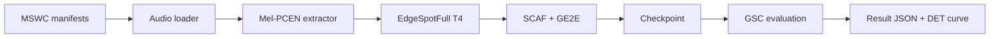
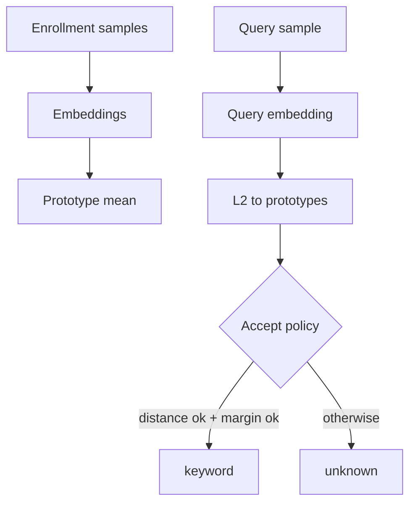
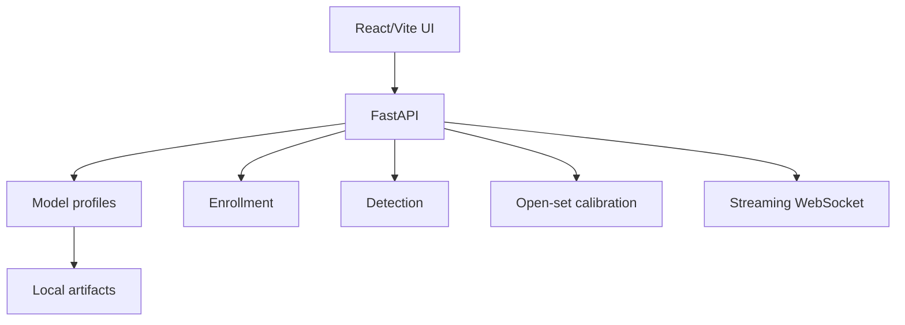
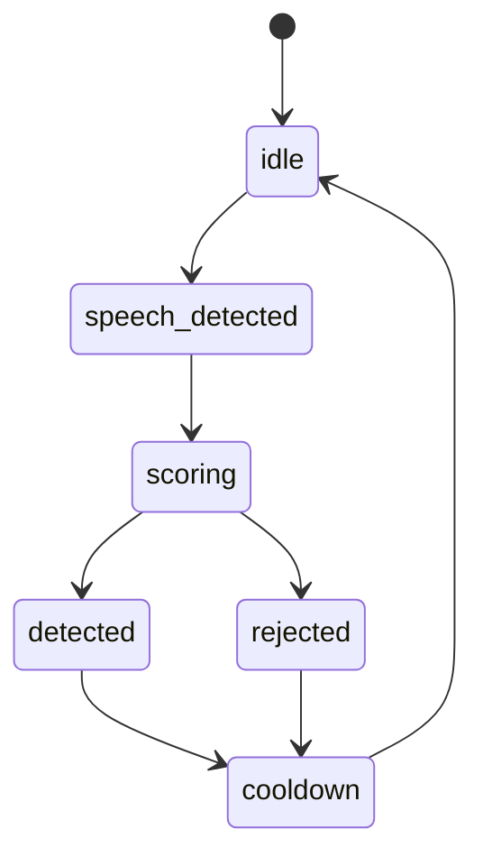
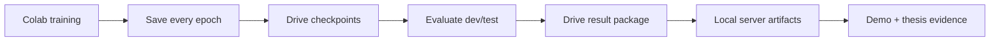

# Thesis Figures

## Figure 1 - End-To-End Training And Evaluation

Caption VI: Luồng huấn luyện và đánh giá từ manifest MSWC đến checkpoint và kết quả GSC.

Caption EN: Training and evaluation flow from MSWC manifests to checkpoints and GSC results.

## Figure 2 - Prototype Inference

Caption VI: Cơ chế inference dựa trên prototype và open-set rejection.

Caption EN: Prototype-based inference and open-set rejection.

## Figure 3 - Demo Web Architecture

## Figure 4 - Streaming State Machine

## Figure 5 - Colab Artifact Pipeline

